# Схема базы данных SQLite — «Ноготочки. Онлайн-запись»

Версия: 9 (прототип) · Дата: 25.09.2026

Источники:

* паспорт сервиса — `docs/pasport-produkta.md`;
* карта связей прототипа — `docs/karta-svyazey-prototipa.xlsx`, лист «Реестр»;
* прототип — `Prototype/Прототип - Ноготочки.dc.html`, `Prototype/Лендинг - Ноготочки.dc.html` и моковые данные `Prototype/data.js`.

Изменения версии 2 по решению заказчика (паспорт в `docs/pasport-produkta.md` обновлен под них):

* в одну запись входит **несколько услуг**, как в корзине визита прототипа;
* выбранное время **удерживается за клиентом 10 минут** на шаге подтверждения;
* у мастеров есть **уровни «мастер» и «топ-мастер»** с разными ценами;
* хранятся **фото работ**: фото с визитов и галерея «Наши работы».

Изменения версии 3: повторная сверка со всеми экранами, переходами и навигацией карты связей. Добавлены поля, которых не хватало экранам. Список находок — в [разделе 3.6](#36-результаты-повторной-сверки-версия-3).

Изменения версии 4: проверка, хватает ли данных для расчета свободных интервалов мастера на день. Добавлены особые дни студии (`studio_day_overrides`) и период действия недельного графика мастера (`master_weekly_hours.valid_from`, `valid_to`). Подробности — в [разделе 7](#7-как-вычисляются-свободные-интервалы-и-слоты).

Изменения версии 5: добавлен перерыв на уборку и дезинфекцию после визита (`services.cleanup_min`, `bookings.busy_until`, `slot_holds.busy_until`), триггеры и расчет слотов учитывают его. В прототип добавлены экран особых дней студии и форма «Новый график с даты» в карточке мастера. Затем добавлены диалог «Фото работ» (A-12), переключатель уровня мастера и второе поле цены (для топ-мастера) в форме услуги; карта связей дополнена экранами A-12, A-20d, A-22p.

Изменения версии 6: подтверждено, что свободное время нигде не хранится и вычисляется в момент запроса; в прототипе сетка занятых ячеек заменена расчетом из графика, записей, блокировок и броней. Подробности — в [разделе 7.5](#75-таблицы-свободных-слотов-нет--ни-в-схеме-ни-в-прототипе).

Изменения версии 7: убраны поля, которые дублировали данные других таблиц: сумма записи, данные об отмене и создании в двух местах, тип услуги и уровень цены в каждой строке состава, мастер и услуга у фото визита. Разбор — в [разделе 11](#11-дублирующиеся-поля).

Изменения версии 8: у `users.password_hash` добавлена проверка формата — база не примет строку, которая не похожа на хеш, поэтому открытый пароль не попадет в нее даже по ошибке в коде. В прототипе учетные записи клиента и администратора хранят хеш пароля вместо самого пароля.

Изменения версии 9: проверены первичные и внешние ключи всех таблиц. Добавлены триггеры, которые проверяют роль пользователя и тип услуги по ссылке; проверки полноты событий журнала и черного списка; убран единственный `ON DELETE CASCADE`; на диаграмму добавлены недостающие связи. Итоги — в [разделе 5.0](#50-проверка-ключей).

---

## Содержание

1. [Общие соглашения](#1-общие-соглашения)
2. [Формат даты и времени](#2-формат-даты-и-времени)
3. [Экраны и данные](#3-экраны-и-данные)
4. [Обзор таблиц](#4-обзор-таблиц)
5. [Таблицы подробно](#5-таблицы-подробно)
6. [Что не хранится, а вычисляется](#6-что-не-хранится-а-вычисляется)
7. [Как вычисляются свободные интервалы и слоты](#7-как-вычисляются-свободные-интервалы-и-слоты)
8. [Бронь времени на 10 минут](#8-бронь-времени-на-10-минут)
9. [Уникальные ограничения](#9-уникальные-ограничения)
10. [Индексы и триггеры](#10-индексы-и-триггеры)
11. [Дублирующиеся поля](#11-дублирующиеся-поля)
12. [Спорные решения](#12-спорные-решения)

---

## 1. Общие соглашения

| Что | Правило |
|---|---|
| Режим таблиц | Все таблицы объявляются как `STRICT` (SQLite 3.37+). Без этого SQLite молча запишет текст в числовое поле. |
| Внешние ключи | При каждом подключении выполняется `PRAGMA foreign_keys = ON`. В SQLite внешние ключи по умолчанию **выключены**, и без этой команды все `FOREIGN KEY` ниже ничего не проверяют. |
| Удаление связанных строк | У всех внешних ключей без исключения стоит `ON DELETE RESTRICT`: строку, на которую кто-то ссылается, удалить нельзя. Мастера, услуги, клиентов и записи не удаляют, а отключают или обезличивают, поэтому история не теряется. Каскадного удаления в схеме нет. |
| Объявление внешних ключей | Только внутри `CREATE TABLE`: `client_id INTEGER NOT NULL REFERENCES users(id) ON DELETE RESTRICT`. В SQLite нельзя добавить внешний ключ к существующей таблице командой `ALTER TABLE` — только пересоздать таблицу, поэтому ключи объявляются сразу. |
| Первичные ключи | `id INTEGER PRIMARY KEY`: целое число, SQLite выдает его сам. |
| Логические поля | `INTEGER` с проверкой `CHECK (поле IN (0, 1))`: в SQLite нет типа BOOLEAN. Названия начинаются с `is_`. |
| Деньги | `INTEGER`, целые рубли. Поля называются `…_rub`. Копеек в прайсе студии нет, а целые числа не дают ошибок округления. |
| Длительность | `INTEGER`, минуты. Поля называются `…_min`. |
| Фиксированные наборы значений | `TEXT` с проверкой `CHECK (поле IN (…))`. В базе хранится английский код (`active`), русская подпись («Активна») есть только в интерфейсе. |
| Файлы | Изображения лежат в файловом хранилище, в базе — только путь к файлу. |
| Служебные поля | В таблицах, которые меняются, есть `created_at` и `updated_at`. `updated_at` обновляет приложение при каждом изменении. |
| Названия | Таблицы — во множественном числе, `snake_case`, на английском. |

Обязательность полей в таблицах ниже: **да** — `NOT NULL`, **нет** — поле может быть пустым (`NULL`).

---

## 2. Формат даты и времени

В базе есть три вида временных данных, и у каждого свой строго фиксированный формат. Смешивать форматы внутри одного вида нельзя.

### 2.1. Момент времени — основной формат

**Формат:** `TEXT`, ISO 8601 в UTC, с миллисекундами и буквой `Z` на конце:

```
YYYY-MM-DDTHH:MM:SS.sssZ        пример: 2026-09-24T07:00:00.000Z
```

Пример выше — это четверг, 24 сентября 2026 года, 10:00 по Москве.

**Где используется:** начало и конец записи, брони и блокировки, срок действия брони, все `created_at`, `updated_at`, `expires_at` и другие поля с суффиксом `_at`.

**Почему так:**

1. **В SQLite нет отдельного типа даты.** Можно хранить текст, число секунд или дробное число дней. Текст читается глазами в любом просмотрщике БД, а `1790406000` — нет.
2. **Строки одинаковой длины сравниваются как время.** Поскольку все значения записаны в одном формате с одинаковой длиной, обычное сравнение строк `<` и `>` дает правильный хронологический порядок. На этом держатся индексы, сортировка, проверка пересечения записей (`начало_1 < конец_2 AND конец_1 > начало_2`) и проверка «бронь еще действует» (`expires_at > сейчас`).
3. **UTC однозначен.** Время не зависит от часового пояса сервера, компьютера разработчика или браузера клиента. Правило «не позднее чем за 24 часа» и 10 минут брони считаются простым вычитанием двух моментов.
4. **Формат совпадает с тем, что выдают оба инструмента.** В JavaScript `new Date().toISOString()` и в SQLite `strftime('%Y-%m-%dT%H:%M:%fZ', 'now')` дают строку ровно такого вида. Поэтому по умолчанию `DEFAULT (strftime('%Y-%m-%dT%H:%M:%fZ', 'now'))`.

Каждое такое поле проверяется на формат:

```
CHECK (поле GLOB '[0-9][0-9][0-9][0-9]-[0-9][0-9]-[0-9][0-9]T[0-9][0-9]:[0-9][0-9]:[0-9][0-9].[0-9][0-9][0-9]Z')
```

Без этой проверки кто-то однажды запишет `2026-09-24 10:00` (без `T`, в местном времени), и сравнение строк начнет давать неправильный порядок — например, пропустит пересечение записей.

**Перевод во время студии.** Часовой пояс студии хранится в настройках (`settings.timezone = 'Europe/Moscow'`). Интерфейс переводит UTC в местное время только при показе. Пример запроса «все записи на 24 сентября по Москве»:

```
starts_at >= '2026-09-23T21:00:00.000Z' AND starts_at < '2026-09-24T21:00:00.000Z'
```

### 2.2. Календарная дата без времени

**Формат:** `TEXT`, `YYYY-MM-DD`, например `2026-09-24`. Это дата по календарю студии, без часового пояса.

**Где используется:** дата рождения клиента, дата в изменениях графика смен (`master_day_overrides.work_date`).

**Почему не момент времени:** день рождения или «рабочий день 3 октября» — это не момент, а день на календаре. Если записать его как UTC-полночь, при переводе в другой пояс он может «съехать» на соседний день.

### 2.3. Время по часам

**Формат:** `TEXT`, `HH:MM`, 24-часовой, например `10:00`, `18:30`. Время всегда местное, по часам студии.

**Где используется:** часы работы студии и шаблон недельного графика мастера («по четвергам с 10:00 до 18:00»).

**Почему не момент времени:** это правило, которое повторяется каждую неделю, а не конкретный момент. Правило «10:00 по Москве» остается верным при любом часовом поясе сервера.

### 2.4. Дни недели

Числом по ISO 8601: `1` — понедельник, …, `7` — воскресенье. Студия работает со вторника по субботу, то есть в дни `2–6`.

Внимание: в JavaScript `Date.getDay()` возвращает `0` для воскресенья, и так же устроены моковые данные прототипа (`closedWeekdays: [0, 1]`). При переносе данных из прототипа воскресенье нужно превратить из `0` в `7`.

---

## 3. Экраны и данные

Экраны перечислены по реестру карты связей. Для каждого указано, какие данные он показывает или принимает и в каких таблицах они лежат. Курсивом отмечены данные, которые **вычисляются** при запросе и не хранятся (см. раздел 6).

### 3.1. Публичная часть и вход

| ID | Экран | Какие данные показывает или принимает | Таблицы |
|---|---|---|---|
| PUB-01 | Лендинг | Секция «Услуги и цены» — только избранные услуги (6 из 14) с описанием, ценой «от», длительностью и отметкой «Дополнение» у опции; секция «Мастера» — имя, специализация, *дни и часы работы*, короткий рассказ о мастере; галерея «Наши работы» (фото с подписью, клик ведет в профиль мастера); контакты — адрес, телефон, ссылки на VK, Telegram и карту; режим работы студии. Первый экран, полоса доверия, «Как это работает», отзывы и финальный призыв — статичный контент страницы, в БД не хранится. | `services`, `masters`, `master_weekly_hours`, `work_photos`, `settings`, `studio_hours` |
| PUB-05 | Профиль мастера | Имя, уровень, специализация, опыт в годах, рассказ о мастере, отметка *«В отпуске до …»*, услуги мастера с ценами *по его уровню*, опубликованные фото работ мастера. | `masters`, `master_services`, `services`, `time_blocks`, `work_photos` |
| AUTH-01 | Вход клиента | Телефон или e-mail и пароль; счетчик неудачных попыток. | `users`, `sessions` |
| AUTH-02 | Подтверждение кода | Код из SMS, срок действия, число попыток. | `auth_codes` |
| AUTH-03 | Регистрация | Имя, телефон, e-mail, пароль (сохраняется только хеш), согласие на обработку персональных данных, согласие на новости. | `users` |
| AUTH-04 | Вход сотрудника | Телефон или e-mail и пароль администратора. | `users`, `sessions` |
| AUTH-06, AUTH-08 | Восстановление и сброс пароля | Телефон или e-mail; одноразовый код или ссылка с ограниченным сроком действия; новый пароль. | `auth_codes`, `users` |

### 3.2. Запись клиента

| ID | Экран | Какие данные показывает или принимает | Таблицы |
|---|---|---|---|
| BOOK-01 | Шаг 1. Услуги | Категории и услуги (название, описание, длительность, цена «от»); корзина визита из нескольких услуг с *итогом*; отметка «это опция» для «Дизайна ногтей» и с какими услугами опция доступна; предупреждение о *несовместимых услугах*; *«ни один мастер не выполняет все выбранные услуги»*. | `service_categories`, `services`, `service_addon_rules`, `service_incompatibilities`, `master_services` |
| BOOK-M4 | Детали услуги | Название, описание, длительность, цена. | `services` |
| BOOK-M5 | Мастер не выполняет выбранные услуги | *Список услуг из корзины, которых нет у мастера*. | `master_services` |
| BOOK-02 | Шаг 2. Мастер | Вариант «Любой свободный мастер»; активные мастера, которые выполняют **все** выбранные услуги; уровень; *стоимость корзины по уровню мастера*; специализация; отметка об отпуске; *ближайшее свободное время*; неподходящие мастера со списком *невыполняемых услуг*. | `masters`, `master_services`, `services`, `time_blocks` |
| BOOK-03 | Шаг 3. Время | Календарь в пределах горизонта записи; *свободные слоты*, сгруппированные по времени суток; отметка *«У вас запись в это время»* на слоте; *общая длительность визита*; при выборе «Любой мастер» — *назначенный мастер* и *другие мастера, свободные в этот слот*; закрытые дни студии с причиной («Новогодние праздники»). При нажатии «Продолжить» создается бронь. | `settings`, `studio_hours`, `studio_day_overrides`, `master_weekly_hours`, `master_day_overrides`, `time_blocks`, `bookings`, `slot_holds` |
| BOOK-04 | Шаг 4. Подтверждение | «Время закреплено за вами еще MM:SS» (*остаток брони*); услуги с ценами, мастер, дата и время, адрес, итоговые стоимость и длительность, имя и телефон клиента, комментарий для мастера, правило 24 часов. Запись создается здесь, бронь при этом снимается. | читает `slot_holds`, `services`, `masters`, `settings`, `users`; пишет `bookings`, `booking_items`; удаляет `slot_holds` |
| BOOK-05 | Успех | Данные только что созданной записи; «Добавить в календарь» (*файл календаря* из данных записи); «Как добраться» (ссылка на карту). | `bookings`, `booking_items`, `masters`, `settings` |
| BOOK-06 | Ошибка | Телефон студии. | `settings` |
| BOOK-M1 | Слот занят | Сообщение о занятом времени и *альтернативные слоты*. Появляется, когда база отклонила бронь или запись (раздел 10.3). | `bookings`, `slot_holds` (триггеры) |
| BOOK-M2 | Время брони истекло | `slot_holds.expires_at` прошел. «Проверить снова» пытается создать новую бронь на то же время. | `slot_holds` |

### 3.3. Личный кабинет клиента

| ID | Экран | Какие данные показывает или принимает | Таблицы |
|---|---|---|---|
| CAB-01 | Мои записи | Баннер «Запись … была отменена салоном» с крестиком, который его скрывает; ближайшая запись: дата, время, *обратный отсчет*, статус, услуги, мастер, адрес; *можно ли перенести или отменить*; остальные предстоящие записи; *«Повторить последний визит»*; в пустом кабинете — популярные услуги с ценой «от». | `bookings`, `booking_items`, `booking_events`, `masters`, `services`, `settings` |
| CAB-02 | История | Прошедшие и отмененные записи с фильтром по статусу. | `bookings`, `booking_items`, `masters` |
| CAB-03 | Карточка записи | Услуги, статус, дата и время, мастер, *стоимость*, комментарий, причина отмены (из события `cancelled`), адрес. | `bookings`, `booking_items`, `booking_events`, `masters`, `settings` |
| CAB-04 | Перенос записи | «Было → стало»: старые и новые дата, время, мастер, цена; свободные слоты; «Время удержано еще MM:SS». Меняет существующую запись. | `bookings`, `booking_items`, `booking_events`, `slot_holds` |
| CAB-05 | Отмена записи | Итог записи; причина отмены (варианты и свободный текст). | `bookings`, `booking_events` |
| CAB-07 | Профиль | Имя, телефон, e-mail (смена — через код), смена пароля. | `users`, `auth_codes` |
| CAB-10 | Удаление аккаунта | Подтверждение. Предстоящие записи отменяются, персональные данные обезличиваются. | `users`, `bookings`, `booking_events`, `work_photos` |

### 3.4. Раздел администратора

| ID | Экран | Какие данные показывает или принимает | Таблицы |
|---|---|---|---|
| A-01, A-01w | Шахматка на день и неделю | Мастера и их рабочие часы или выходной на день; записи (время, клиент, услуги, статус, отметка *«новый клиент»*, отметка «клиент выбрал любого мастера») и заштрихованный *перерыв на уборку* после каждой записи; блокировки с причиной; *сводка: число записей, свободные часы, активные, неявки, отмены*; *загрузка мастера в %*. | `masters`, `master_weekly_hours`, `master_day_overrides`, `time_blocks`, `bookings`, `booking_items`, `users` |
| A-01d | Перетаскивание записи | Новые время и мастер записи. | `bookings`, `booking_items`, `booking_events` |
| A-02 | Создание записи | Поиск клиента по имени и телефону или новый клиент; несколько услуг; мастер и отметка *«любимый мастер клиента»*; дата и время; *ближайшие свободные окна*; комментарий; итог. | `users`, `services`, `masters`, `slot_holds`, `bookings`, `booking_items` |
| A-02s | Конфликт слота | Сообщение «слот только что занят» и *альтернативы*. | `bookings`, `slot_holds` (триггеры) |
| A-03 | Поповер записи | Клиент, статус, услуги, мастер, время и *уборка до …*, сумма; действия «Перенести», «Визит завершен», «Отметить неявку», «Отменить», у завершенной записи — «Фото работ» (A-12). | `bookings`, `booking_items`, `users`, `masters`, `work_photos` |
| A-04 | Диалог переноса | Текущее время; новый мастер; новое время; причина переноса. | `bookings`, `booking_items`, `booking_events` |
| A-05 | Диалог отмены | Кто отменил (клиент или студия) и комментарий. | `bookings`, `booking_events` |
| A-06 | Диалог неявки | Отметка «Клиент не пришел». | `bookings`, `booking_events` |
| A-07 | Клиенты | Имя, телефон, *число визитов*, *последний визит*, *любимый мастер*, *метки* («Новый», «Постоянный», «Давно не приходил»), отметка «в черном списке»; поиск и сортировка. | `users`, `client_profiles`, `bookings` |
| A-08 | Быстрый просмотр клиента | То же, что в списке, плюс причина черного списка. | `users`, `client_profiles`, `bookings` |
| A-09 | Карточка клиента | Телефон, e-mail, дата рождения, источник; *сводка*: визиты, отмены, неявки, первый и последний визит; история визитов с причинами отмен и *числом фото*; предстоящие записи; заметки с автором и датой (автором может быть мастер: «Анна Ковалева (мастер)»); поле «Важно». | `users`, `client_profiles`, `client_notes`, `bookings`, `booking_items`, `booking_events`, `work_photos` |
| A-11 | В черный список | Причина (обязательна). | `client_profiles` |
| A-19 | Мастера | Имя, уровень, специализация, статус (активен или отключен), рабочие дни и часы, *записей сегодня*. | `masters`, `master_weekly_hours`, `bookings` |
| A-20 | График смен на месяц | Для каждого мастера и дня месяца: рабочий день, выходной или «студия закрыта» (по дню недели или особому дню студии); особые дни студии отмечены рамкой, подсказка показывает причину. Клик меняет день мастера. | `master_weekly_hours`, `master_day_overrides`, `studio_hours`, `studio_day_overrides` |
| A-20, блок «Особые дни студии» | Особые дни студии | Список особых дней: дата, день недели, тип («Студия закрыта», «Особые часы 10:00–16:00», «Доп. рабочий день»), причина, «Удалить». Форма добавления: дата, «Закрыта весь день» или «Работает в особые часы» с часами, причина (видна клиентам). До сохранения — *список записей на эту дату*, которые не помещаются в новый режим. | `studio_day_overrides`, `bookings` |
| A-22 | Карточка мастера | Имя, статус, специализация, переключатель уровня «Мастер / Топ-мастер», услуги с длительностью и *ценой по уровню мастера*, рабочие дни и часы; блок «Новый график с …» с *записями, которые в него не попадают*, и кнопкой «Отменить изменение». Форма «Новый график с даты»: дата начала, рабочие дни (пн и вс недоступны — студия закрыта), начало и конец смены. | `masters`, `master_services`, `services`, `master_weekly_hours`, `bookings` |
| A-23 | Услуги | Категории; для услуги — название, длительность, цены для мастера и топ-мастера, мастера, статус. | `service_categories`, `services`, `master_services` |
| A-24 | Форма услуги | Название, описание, категория, длительность, уборка после услуги (мин), цена для мастера, цена для топ-мастера, мастера, фото, «включена». | `services`, `master_services`, `service_categories` |
| A-S1 | Запись изменена другим сотрудником | Номер версии записи, чтобы заметить одновременное редактирование. | `bookings.version` |
| A-12 | Фото работ | Диалог открывается из поповера завершенной записи (A-03) и из истории визитов (A-09, ссылка «N фото» / «+ Добавить фото»). Загрузка фото, подпись для галереи, отметка «Клиент разрешил публикацию», отметка «В галерее «Наши работы»» (недоступна без согласия), «Удалить»; *число фото в галерее*, ссылка в профиль мастера. | `work_photos`, `bookings`, `masters` |

### 3.5. Служебные экраны

| ID | Экран | Данные |
|---|---|---|
| SYS-03, BOOK-M3 | Сессия истекла | `sessions.expires_at` |
| SYS-04 | Учетная запись заблокирована | `users.blocked_at`, `users.locked_until` |
| BOOK-M6 | Выйти из записи? | При выходе бронь клиента удаляется. |
| SYS-05 | Технические работы | `settings.is_maintenance` включает страницу, `settings.phone` показывается на ней. |
| SYS-01, SYS-06, SYS-07, A-33, A-S2, A-S3, DS-01 | 404, служебные экраны прототипа | Данных из БД нет. |

### 3.6. Результаты повторной сверки (версия 3)

Проверены все экраны реестра, все переходы листа «Связи», все элементы листа «Навигация», а также данные, которые выводят шаблоны прототипа и лендинга. Ниже перечислены данные, для которых в версии 2 не было места в схеме, и что добавлено.

| Экран | Чего не хватало | Что добавлено |
|---|---|---|
| PUB-01, секция «Контакты», подвал (переход L-006, навигация N-13) | Ссылки на VK, Telegram и карту. Кнопка «Как добраться» на BOOK-05 и CAB-03 тоже ведет на карту. | `settings.map_url`, `settings.vk_url`, `settings.telegram_url` |
| PUB-01, секция «Услуги и цены» | На лендинге показаны 6 услуг из 14, выбранные вручную. В схеме нечем отметить, какие именно. | `services.is_featured` |
| CAB-01, пустой кабинет (переход L-241) | Блок «Популярные услуги» — тоже ручной выбор (3 услуги). | Первые три основные услуги с `is_featured = 1` по `sort_order` |
| PUB-01, секция «Мастера» | Короткий рассказ о мастере («Подбирает форму бровей индивидуально под черты лица»). | `masters.bio` |
| BOOK-02 (переход L-030), BOOK-03, A-01 | Клиент выбрал «Любой свободный мастер», и сервис назначил мастера сам. В записи этот факт терялся, а администратору он важен: такую запись можно передать другому мастеру без согласования с клиентом. | `bookings.is_any_master` |
| CAB-01, баннер «Запись была отменена салоном» | Баннер закрывается крестиком и не должен появляться снова. Негде было отметить, что клиент его видел. Уведомлений в сервисе нет, поэтому баннер — единственный способ сообщить клиенту об отмене или переносе, сделанных студией. | `bookings.client_acknowledged_at` |
| A-09, вкладка «Заметки» | Автором заметки в прототипе бывает мастер («Анна Ковалева (мастер)»), а у мастеров нет учетных записей. | `client_notes.master_id` — со слов какого мастера записана заметка |
| SYS-05, технические работы | Страница включается на время плановых работ, но переключателя не было. | `settings.is_maintenance` |
| AUTH-03, согласие на обработку данных | Согласие дается на конкретную редакцию политики. При ее изменении нужно понимать, кто на какую редакцию соглашался. | `users.pd_consent_version` |

Проверено и не требует новых полей — данные вычисляются (раздел 6) или живут только в браузере:

* отметка «У вас запись в это время» на слоте, другие свободные мастера на слот, «Повторить последний визит», отметка «новый клиент» в шахматке, «В отпуске до …», дни и часы мастера на лендинге, файл для календаря;
* черновик записи (выбранные услуги, мастер, дата до создания брони) и закрепленный мастер при входе из профиля — в браузере, как в прототипе (`sessionStorage`). Сервер узнает о выборе, только когда создается бронь;
* поиск, сортировка, фильтры, постраничный вывод и массовое выделение в списке клиентов A-07 — логика интерфейса и запросов;
* варианты причины отмены у клиента (CAB-05) — фиксированный список в интерфейсе, в базу записывается текст;
* полоса доверия на лендинге («6 лет работы», «8 000 записей», «рейтинг 4,9»), шаги «Как это работает», отзывы — статичный контент страницы.

---

## 4. Обзор таблиц

| № | Таблица | Назначение |
|---|---|---|
| 1 | `settings` | Настройки студии: адрес, телефон, часовой пояс, шаг слотов, горизонт записи, правило 24 часов, длительность брони. Одна строка. |
| 2 | `studio_hours` | Режим работы студии по дням недели (вт–сб, 10:00–20:00). |
| 3 | `studio_day_overrides` | Особые дни студии: праздники, санитарные дни, сокращенные и дополнительные рабочие дни. |
| 4 | `users` | Все учетные записи: клиенты и администраторы. Контакты, хеш пароля, роль. |
| 5 | `client_profiles` | Карточка клиента для администратора: дата рождения, источник, «Важно», черный список. |
| 6 | `client_notes` | Заметки администратора о клиенте. |
| 7 | `auth_codes` | Одноразовые коды и ссылки: подтверждение телефона и e-mail, вход по SMS, сброс пароля. |
| 8 | `sessions` | Активные сессии входа. |
| 9 | `service_categories` | Категории услуг: маникюр, педикюр, наращивание, брови. |
| 10 | `services` | Каталог услуг и опций с длительностью и ценами для двух уровней мастеров. |
| 11 | `service_addon_rules` | С какими услугами можно заказать опцию («Дизайн ногтей»). |
| 12 | `service_incompatibilities` | Пары услуг, которые нельзя объединить в один визит. |
| 13 | `masters` | Мастера студии и их уровень: «мастер» или «топ-мастер». |
| 14 | `master_services` | Какие услуги выполняет каждый мастер. |
| 15 | `master_weekly_hours` | Обычный недельный график мастера: дни и часы, с периодом действия. |
| 16 | `master_day_overrides` | Изменения графика на конкретную дату: дополнительный рабочий день или выходной. |
| 17 | `time_blocks` | Блокировки времени мастера: обед, личное время, выходной, отпуск, больничный. |
| 18 | `slot_holds` | Временная бронь выбранного времени на 10 минут, пока клиент подтверждает запись. |
| 19 | `bookings` | Записи клиентов: мастер, время, статус, стоимость. |
| 20 | `booking_items` | Состав записи: одна или несколько услуг и опции, с ценой и длительностью на момент записи. |
| 21 | `booking_events` | История изменений записи: создание, перенос, смена статуса. |
| 22 | `work_photos` | Фото работ: снимки с визитов и галерея «Наши работы». |

### Связи между таблицами

```mermaid
erDiagram
    users ||--o| client_profiles : "карточка клиента"
    users ||--o{ client_notes : "заметки о клиенте"
    users ||--o{ auth_codes : "коды"
    users ||--o{ sessions : "сессии"
    users ||--o{ bookings : "клиент записи"
    users ||--o| slot_holds : "держит бронь"
    users ||--o{ studio_day_overrides : "вносит"
    users ||--o{ client_profiles : "внес в черный список"
    users ||--o{ client_notes : "автор заметки"
    users ||--o{ bookings : "создал запись"
    users ||--o{ booking_events : "автор изменения"
    users ||--o{ master_day_overrides : "вносит"
    users ||--o{ time_blocks : "вносит"
    users ||--o{ work_photos : "загружает"
    masters ||--o{ booking_events : "мастер до и после переноса"
    service_categories ||--o{ services : "содержит"
    services ||--o{ service_addon_rules : "опция / основная"
    services ||--o{ service_incompatibilities : "несовместимы"
    masters ||--o{ client_notes : "со слов мастера"
    masters ||--o{ master_services : "выполняет"
    services ||--o{ master_services : "выполняется"
    masters ||--o{ master_weekly_hours : "недельный график"
    masters ||--o{ master_day_overrides : "изменения графика"
    masters ||--o{ time_blocks : "блокировки"
    masters ||--o{ slot_holds : "бронь времени"
    masters ||--o{ bookings : "мастер записи"
    bookings ||--o{ slot_holds : "перенос"
    bookings ||--|{ booking_items : "состав"
    services ||--o{ booking_items : "услуга"
    bookings ||--o{ booking_events : "история"
    masters ||--o{ work_photos : "автор (фото без визита)"
    booking_items ||--o{ work_photos : "фото услуги визита"
    services ||--o{ work_photos : "услуга (фото без визита)"
```



---

## 5. Таблицы подробно

Обозначения в колонке «Ключ»: **PK** — первичный ключ, **FK → таблица** — внешний ключ, **UQ** — уникальное значение.

### 5.0. Проверка ключей

Проверка версии 9: все 22 таблицы и 36 внешних ключей.

**Первичные ключи есть у всех таблиц.** У 14 таблиц — суррогатный `id`, у восьми — естественный или составной ключ, потому что сама комбинация и есть смысл строки: `studio_hours (weekday)`, `studio_day_overrides (work_date)`, `client_profiles (user_id)`, `master_services (master_id, service_id)`, `master_weekly_hours (master_id, weekday, valid_from)`, `master_day_overrides (master_id, work_date)`, `service_addon_rules` и `service_incompatibilities` — пары услуг.

**Все внешние ключи ссылаются на первичный ключ существующей таблицы и совпадают с ним по типу** (`INTEGER` → `INTEGER`). Полей-ссылок без объявленного внешнего ключа нет. Взаимных ссылок двух таблиц друг на друга нет.

**Найденные проблемы и исправления:**

| Проблема | Чем грозила | Исправление |
|---|---|---|
| Внешний ключ на `users.id` не проверяет роль. В поле «кто внес блокировку» можно было записать клиента, в `bookings.client_id` — администратора | Клиент числится автором графика или фото; запись «принадлежит» администратору и не видна ни одному клиенту | Триггеры проверки роли по ссылке (раздел 10.8) и запрет менять роль пользователя |
| `service_addon_rules`: обе ссылки ведут на `services`, но не проверяют тип. Опцией могла стать основная услуга, и наоборот | «Маникюр» — опция к «Дизайну»; правило, которое никогда не сработает правильно | Триггер типа услуги (раздел 10.9) вместо проверки в приложении |
| `client_profiles.blacklisted_by` не входил в проверку черного списка | Клиент в черном списке без автора или автор при пустом черном списке | Проверка связывает все три поля (раздел 5.5) |
| `booking_events`: ссылки на мастеров и поля переноса и отмены необязательны для всех типов событий | Перенос без старого и нового мастера; отмена без статуса. Журнал теряет смысл именно там, где он нужен для спора | Проверки полноты по типу события (раздел 5.21) |
| `slot_holds.booking_id` — единственный `ON DELETE CASCADE` в схеме | Ничего не ломал (записи не удаляются), но противоречил правилу «удаления по ссылке нет» и мог молча удалить брони, если это правило когда-нибудь изменят | Обычный `RESTRICT`, как у всех |
| На диаграмме не было восьми связей: авторы изменений, мастер в журнале, автор черного списка, создатель записи | Диаграмма показывала не все зависимости | Связи добавлены в раздел 4 |

**Индексы на ссылающихся полях.** SQLite не создает их сам. При удалении строки-родителя база ищет ссылки на нее во всех дочерних таблицах, и без индекса перебирает их целиком. Здесь это не проблема: родительские строки (пользователи, мастера, услуги, записи, состав записи) не удаляются. Удаляются только строки, на которые никто не ссылается: блокировки, брони, фото, особые дни, сессии и коды. Индексы нужны только под частые запросы, они перечислены в разделе 10.1.

### 5.1. `settings` — настройки студии

Одна строка с общими параметрами, которые нужны для расчета слотов и показа контактов. Параметры не зашиты в код, чтобы их можно было поменять без разработчика.

| Поле | Тип | Обяз. | Ключ | Описание |
|---|---|---|---|---|
| `id` | INTEGER | да | PK | Всегда `1`: `CHECK (id = 1)` не дает создать вторую строку настроек. |
| `studio_name` | TEXT | да | | «Ноготочки». |
| `address` | TEXT | да | | «Москва, ул. Цветочная, 12». |
| `phone` | TEXT | да | | Телефон студии для экранов ошибок и запрета отмены. Формат E.164: `+79991234567`. |
| `map_url` | TEXT | нет | | Ссылка на студию в картах. Используется в контактах лендинга и в кнопке «Как добраться» (BOOK-05, CAB-03). |
| `vk_url` | TEXT | нет | | Ссылка на сообщество VK. `NULL` — ссылка не показывается. |
| `telegram_url` | TEXT | нет | | Ссылка на Telegram студии. `NULL` — ссылка не показывается. |
| `timezone` | TEXT | да | | Часовой пояс IANA: `Europe/Moscow`. |
| `slot_step_min` | INTEGER | да | | Шаг слотов, `30`. `CHECK (slot_step_min > 0)`. |
| `booking_horizon_days` | INTEGER | да | | На сколько дней вперед открыта запись, `90`. |
| `min_lead_min` | INTEGER | да | | Минимум минут от текущего момента до начала записи, `120`. |
| `client_change_deadline_hours` | INTEGER | да | | До скольких часов до визита клиент может отменить или перенести запись, `24`. |
| `slot_hold_min` | INTEGER | да | | Сколько минут выбранное время удерживается за клиентом, `10`. `CHECK (slot_hold_min BETWEEN 1 AND 60)`. |
| `is_maintenance` | INTEGER | да | | `0` или `1`, `DEFAULT 0`. `1` — плановые технические работы: клиенты видят страницу SYS-05 «Сервис временно недоступен» с телефоном студии, запись и бронь не создаются. Раздел администратора продолжает работать. |
| `updated_at` | TEXT | да | | Момент последнего изменения. |

### 5.2. `studio_hours` — режим работы студии

Строка есть только для дней, когда студия открыта. Если строки нет, студия в этот день закрыта (воскресенье и понедельник).

| Поле | Тип | Обяз. | Ключ | Описание |
|---|---|---|---|---|
| `weekday` | INTEGER | да | PK | День недели ISO, `CHECK (weekday BETWEEN 1 AND 7)`. |
| `open_time` | TEXT | да | | `HH:MM`, например `10:00`. |
| `close_time` | TEXT | да | | `HH:MM`, например `20:00`. `CHECK (close_time > open_time)`. |

### 5.3. `studio_day_overrides` — особые дни студии

Даты, когда студия работает не по обычному режиму: закрыта целиком (праздник, санитарный день, ремонт), работает сокращенный день (31 декабря до 16:00) или открыта в обычно нерабочий день (понедельник перед 8 Марта). Строка на дату важнее `studio_hours` и действует сразу на всех мастеров.

| Поле | Тип | Обяз. | Ключ | Описание |
|---|---|---|---|---|
| `work_date` | TEXT | да | PK | `YYYY-MM-DD`, дата по календарю студии. |
| `is_open` | INTEGER | да | | `0` — студия закрыта весь день, `1` — открыта в часы ниже. |
| `open_time` | TEXT | нет | | `HH:MM`. Обязательно, если `is_open = 1`. |
| `close_time` | TEXT | нет | | `HH:MM`. Обязательно, если `is_open = 1`. |
| `reason` | TEXT | да | | Причина для администратора и подпись в календаре клиента: «Новогодние праздники», «Санитарный день», «Предпраздничный день». |
| `created_by` | INTEGER | да | FK → `users.id` | Администратор. |
| `created_at` | TEXT | да | | |

Проверка: `CHECK ((is_open = 1 AND open_time IS NOT NULL AND close_time IS NOT NULL AND close_time > open_time) OR (is_open = 0 AND open_time IS NULL AND close_time IS NULL))`.

Когда администратор закрывает день, в котором уже есть записи, сервис показывает их список, как при блокировке (сценарий 8). Дальше администратор переносит их или отменяет со статусом «Отменена студией». Сами записи база не трогает.

### 5.4. `users` — учетные записи

Одна таблица для клиентов и администраторов, роль указана в поле `role`. Отдельной таблицы для мастеров нет: у мастеров нет личного кабинета.

| Поле | Тип | Обяз. | Ключ | Описание |
|---|---|---|---|---|
| `id` | INTEGER | да | PK | |
| `role` | TEXT | да | | `CHECK (role IN ('client', 'admin'))`. |
| `name` | TEXT | да | | Имя, как его видят администратор и сам клиент. |
| `phone` | TEXT | нет | UQ | Телефон в формате E.164: `+79112223344`. `CHECK`: начинается с `+`, дальше только цифры, длина 8–16 символов. |
| `email` | TEXT | нет | UQ | Хранится в нижнем регистре, `COLLATE NOCASE`. `CHECK (email = lower(email) AND email LIKE '%_@_%')`. |
| `password_hash` | TEXT | нет | | Хеш пароля вместе с алгоритмом, параметрами и солью, например `$argon2id$v=19$m=65536,t=3,p=4$…`. **Поля для самого пароля нет, и открытый пароль не хранится нигде в базе** — ни здесь, ни в журналах. Пароль, введенный при регистрации, входе, смене или сбросе, сервер сразу превращает в хеш (argon2id; допустимы bcrypt и PBKDF2-SHA256) и дальше работает только с хешем. `NULL` означает, что клиента завел администратор и клиент еще не зарегистрировался сам (см. спорное решение 2). |
| `phone_verified_at` | TEXT | нет | | Когда телефон подтвержден кодом. |
| `email_verified_at` | TEXT | нет | | Когда e-mail подтвержден. |
| `pd_consent_at` | TEXT | нет | | Когда дано согласие на обработку персональных данных (152-ФЗ). |
| `pd_consent_version` | TEXT | нет | | На какую редакцию политики обработки данных дано согласие, например `2026-09-01`. Заполняется вместе с `pd_consent_at`: `CHECK ((pd_consent_at IS NULL) = (pd_consent_version IS NULL))`. |
| `marketing_consent_at` | TEXT | нет | | Когда дано согласие на новости и акции. `NULL` — согласия нет. |
| `failed_login_attempts` | INTEGER | да | | Неудачные входы подряд, `DEFAULT 0`. Обнуляется после успешного входа. |
| `locked_until` | TEXT | нет | | До какого момента вход временно запрещен после серии неудачных попыток. |
| `blocked_at` | TEXT | нет | | Когда администратор закрыл доступ этой учетной записи (экран SYS-04). |
| `deleted_at` | TEXT | нет | | Когда аккаунт удален и данные обезличены. |
| `created_at` | TEXT | да | | |
| `updated_at` | TEXT | да | | |

Проверки на уровне строки:

* `CHECK (deleted_at IS NOT NULL OR phone IS NOT NULL OR email IS NOT NULL)` — у живого пользователя есть хотя бы один способ связи и входа.
* `CHECK (password_hash IS NULL OR ((password_hash GLOB '$argon2id$*' OR password_hash GLOB '$2[aby]$*' OR password_hash GLOB 'pbkdf2-sha256$*') AND length(password_hash) >= 50))` — в поле может лежать только хеш известного формата. Открытый пароль вроде `Test1234` база отклонит, даже если в коде забыли его захешировать. Проверка ловит ошибки, но не заменяет хеширование на сервере;
* `CHECK (role <> 'admin' OR password_hash IS NOT NULL)` — администратор всегда входит по паролю.
* `CHECK (role <> 'client' OR password_hash IS NULL OR pd_consent_at IS NOT NULL)` — клиент, который зарегистрировался сам, обязательно дал согласие на обработку данных.

### 5.5. `client_profiles` — карточка клиента

Сведения, которые ведет только администратор. Клиент их не видит. Строка появляется, когда администратор заполняет карточку. Если строки нет, карточка пустая.

| Поле | Тип | Обяз. | Ключ | Описание |
|---|---|---|---|---|
| `user_id` | INTEGER | да | PK, FK → `users.id` | Клиент. Одна карточка на клиента. |
| `birth_date` | TEXT | нет | | `YYYY-MM-DD`. |
| `acquisition_source` | TEXT | нет | | Откуда пришел клиент: «Инстаграм студии», «Рекомендация подруги». |
| `important_note` | TEXT | нет | | Блок «Важно»: противопоказания, аллергии, особенности. |
| `blacklisted_at` | TEXT | нет | | Когда клиента внесли в черный список. `NULL` — не в списке. |
| `blacklist_reason` | TEXT | нет | | Причина, обязательна при внесении. |
| `blacklisted_by` | INTEGER | нет | FK → `users.id` | Какой администратор внес в список. |
| `updated_at` | TEXT | да | | |

Проверка: `CHECK ((blacklisted_at IS NULL) = (blacklist_reason IS NULL) AND (blacklisted_at IS NULL) = (blacklisted_by IS NULL))` — либо клиент в черном списке и указаны причина и администратор, который его внес, либо ни того, ни другого. Экран A-11 требует причину, и база гарантирует это правило даже при ошибке в интерфейсе.

### 5.6. `client_notes` — заметки о клиенте

| Поле | Тип | Обяз. | Ключ | Описание |
|---|---|---|---|---|
| `id` | INTEGER | да | PK | |
| `client_id` | INTEGER | да | FK → `users.id` | О каком клиенте заметка. |
| `author_id` | INTEGER | да | FK → `users.id` | Какой администратор внес заметку. |
| `master_id` | INTEGER | нет | FK → `masters.id` | Со слов какого мастера записана заметка. У мастеров нет учетных записей, поэтому заметку вносит администратор, а мастер указывается здесь. В карточке показывается «Анна Ковалева (мастер)». `NULL` — заметка администратора. |
| `text` | TEXT | да | | `CHECK (length(trim(text)) > 0)`. |
| `created_at` | TEXT | да | | |

### 5.7. `auth_codes` — одноразовые коды и ссылки

Коды из SMS, ссылки для сброса пароля и подтверждения e-mail. Сам код, как и пароль, не хранится: в базе лежит только его хеш.

| Поле | Тип | Обяз. | Ключ | Описание |
|---|---|---|---|---|
| `id` | INTEGER | да | PK | |
| `user_id` | INTEGER | да | FK → `users.id` | Чей код. |
| `purpose` | TEXT | да | | `CHECK (purpose IN ('verify_phone', 'verify_email', 'login', 'reset_password'))`. |
| `target` | TEXT | да | | Куда отправлен код: телефон или e-mail. При смене телефона здесь новый номер, который еще не записан в `users`. |
| `code_hash` | TEXT | да | | Хеш кода или токена ссылки. |
| `attempts` | INTEGER | да | | Сколько раз ввели неверный код, `DEFAULT 0`. В прототипе после трех ошибок код блокируется. |
| `expires_at` | TEXT | да | | До какого момента код действует. |
| `consumed_at` | TEXT | нет | | Когда код использован. Использованный код повторно не принимается. |
| `created_at` | TEXT | да | | |

### 5.8. `sessions` — сессии входа

| Поле | Тип | Обяз. | Ключ | Описание |
|---|---|---|---|---|
| `id` | INTEGER | да | PK | |
| `user_id` | INTEGER | да | FK → `users.id` | |
| `token_hash` | TEXT | да | UQ | Хеш токена из cookie. Сам токен в базе не хранится: даже при утечке базы украденными строками нельзя войти. |
| `created_at` | TEXT | да | | |
| `last_seen_at` | TEXT | да | | Последний запрос с этой сессией. |
| `expires_at` | TEXT | да | | Когда сессия истекает (экран «Сессия истекла»). |
| `revoked_at` | TEXT | нет | | Когда сессию закрыли: выход, смена пароля, блокировка. |

### 5.9. `service_categories` — категории услуг

| Поле | Тип | Обяз. | Ключ | Описание |
|---|---|---|---|---|
| `id` | INTEGER | да | PK | |
| `name` | TEXT | да | UQ | «Маникюр», «Педикюр», «Наращивание», «Брови». `COLLATE NOCASE`. |
| `sort_order` | INTEGER | да | | Порядок показа, `DEFAULT 0`. |
| `is_active` | INTEGER | да | | `0` или `1`. Отключенная категория скрыта из записи. |

### 5.10. `services` — услуги и опции

У каждой услуги две цены: для мастера и для топ-мастера. Какая из них применяется, зависит от уровня мастера, к которому записывается клиент.

| Поле | Тип | Обяз. | Ключ | Описание |
|---|---|---|---|---|
| `id` | INTEGER | да | PK | |
| `category_id` | INTEGER | да | FK → `service_categories.id` | |
| `kind` | TEXT | да | | `CHECK (kind IN ('main', 'addon'))`. `main` — основная услуга, `addon` — опция к ней («Дизайн ногтей»). |
| `name` | TEXT | да | UQ | Название. `COLLATE NOCASE`. |
| `description` | TEXT | нет | | Описание для клиента. |
| `cleanup_min` | INTEGER | да | | Перерыв на уборку и дезинфекцию после услуги, минуты. `DEFAULT 0`, `CHECK (cleanup_min BETWEEN 0 AND 60)`. Маникюр, педикюр, наращивание — `15`, брови — `10`, дизайн — `0`. Клиент его не видит. |
| `duration_min` | INTEGER | да | | Длительность. `CHECK (duration_min > 0)`. Для дизайна — фиксированные `30`. Не зависит от уровня мастера. |
| `price_master_rub` | INTEGER | да | | Цена за единицу у мастера. `CHECK (price_master_rub >= 0)`. Эта же цена показывается как «от» в каталоге. Маникюр с покрытием — `1800`, дизайн — `300`. |
| `price_top_rub` | INTEGER | да | | Цена за единицу у топ-мастера. `CHECK (price_top_rub >= price_master_rub)`. Маникюр с покрытием — `2200`, дизайн — `300`. |
| `price_unit` | TEXT | нет | | Подпись к цене, если она не за всю услугу: «за 2 ногтя». |
| `max_quantity` | INTEGER | да | | Сколько единиц можно заказать, `DEFAULT 1`. Для дизайна — `5` (все 10 ногтей). `CHECK (max_quantity >= 1)`. |
| `photo_url` | TEXT | нет | | Фото услуги из формы A-24. |
| `is_featured` | INTEGER | да | | `0` или `1`, `DEFAULT 0`. `1` — услуга показывается в секции «Услуги и цены» на лендинге. Первые три основные услуги с этой отметкой показываются как «популярные» в пустом кабинете клиента (CAB-01). |
| `sort_order` | INTEGER | да | | Порядок внутри категории, а также порядок избранных услуг на лендинге. |
| `is_active` | INTEGER | да | | `0` или `1`. Отключенная услуга пропадает из новых записей, но остается в созданных (сценарий 7). |
| `created_at` | TEXT | да | | |
| `updated_at` | TEXT | да | | |

Проверка: `CHECK (kind = 'addon' OR max_quantity = 1)` — количество больше одного бывает только у опции.

### 5.11. `service_addon_rules` — к чему можно добавить опцию

| Поле | Тип | Обяз. | Ключ | Описание |
|---|---|---|---|---|
| `addon_service_id` | INTEGER | да | PK, FK → `services.id` | Опция, например «Дизайн ногтей». |
| `main_service_id` | INTEGER | да | PK, FK → `services.id` | Основная услуга, с которой опция доступна: маникюр, маникюр и педикюр, наращивание. |

Первичный ключ составной: `(addon_service_id, main_service_id)`. Опцию можно добавить в запись, если в ней есть **хотя бы одна** основная услуга из этого списка. Правило проверяет приложение при сохранении записи. То, что `addon_service_id` указывает на опцию, а `main_service_id` — на основную услугу, проверяет триггер (раздел 10.9): `CHECK` в SQLite не может заглянуть в другую таблицу.

### 5.12. `service_incompatibilities` — несовместимые услуги

Пары услуг, которые нельзя объединить в один визит, с объяснением для клиента. Из прототипа: маникюр с покрытием и наращивание делаются на одних и тех же ногтях.

| Поле | Тип | Обяз. | Ключ | Описание |
|---|---|---|---|---|
| `service_a_id` | INTEGER | да | PK, FK → `services.id` | Первая услуга пары — с меньшим `id`. |
| `service_b_id` | INTEGER | да | PK, FK → `services.id` | Вторая услуга пары — с бо́льшим `id`. |
| `reason` | TEXT | да | | Текст для клиента: «Маникюр с покрытием и наращивание выполняются на одних и тех же ногтях — выберите одну из услуг». |

Проверка: `CHECK (service_a_id < service_b_id)`. Пара хранится одной строкой в едином порядке, поэтому «А несовместимо с Б» и «Б несовместимо с А» не записываются дважды, а услуга не может быть несовместима сама с собой.

### 5.13. `masters` — мастера

| Поле | Тип | Обяз. | Ключ | Описание |
|---|---|---|---|---|
| `id` | INTEGER | да | PK | |
| `name` | TEXT | да | | «Анна Ковалева». |
| `level` | TEXT | да | | `CHECK (level IN ('master', 'top_master'))`, `DEFAULT 'master'`. От уровня зависит цена: `price_master_rub` или `price_top_rub`. В интерфейсе — «Мастер» и «Топ-мастер». |
| `specialty` | TEXT | нет | | «Маникюр и педикюр», «Мастер по бровям». |
| `experience_years` | INTEGER | нет | | Опыт для публичного профиля. `CHECK (experience_years >= 0)`. |
| `bio` | TEXT | нет | | Короткий рассказ о мастере для лендинга и профиля: «Подбирает форму бровей индивидуально под черты лица». |
| `photo_url` | TEXT | нет | | Портрет мастера. |
| `sort_order` | INTEGER | да | | Порядок в списках. |
| `is_active` | INTEGER | да | | `0` или `1`. Отключенного мастера не предлагают клиентам, но он остается в истории записей. |
| `created_at` | TEXT | да | | |
| `updated_at` | TEXT | да | | |

### 5.14. `master_services` — кто что выполняет

| Поле | Тип | Обяз. | Ключ | Описание |
|---|---|---|---|---|
| `master_id` | INTEGER | да | PK, FK → `masters.id` | |
| `service_id` | INTEGER | да | PK, FK → `services.id` | |

Первичный ключ — `(master_id, service_id)`. Опция «Дизайн ногтей» тоже привязывается здесь: у Анны Ковалевой строка есть, у Елены Смирновой нет. Поэтому в сценарии 2 при выборе наращивания с дизайном остается только Анна. Для записи из нескольких услуг мастер должен выполнять **все** услуги из корзины.

### 5.15. `master_weekly_hours` — обычный недельный график

По одной строке на каждый рабочий день недели мастера в пределах периода действия. Если на дату не нашлось строки, в этот день мастер не работает.

Период действия нужен, чтобы менять график заранее: «с 1 октября Анна работает ср–сб». Старые строки закрываются датой 30 сентября, новые начинаются с 1 октября. Записи на сентябрь считаются по старому графику, записи на октябрь — по новому. Так же оформляется приход нового мастера (график с первого рабочего дня) и уход (график закрывается последним днем).

| Поле | Тип | Обяз. | Ключ | Описание |
|---|---|---|---|---|
| `master_id` | INTEGER | да | PK, FK → `masters.id` | |
| `weekday` | INTEGER | да | PK | ISO, `CHECK (weekday BETWEEN 1 AND 7)`. |
| `valid_from` | TEXT | да | PK | `YYYY-MM-DD`, с какой даты действует строка (включительно). |
| `valid_to` | TEXT | нет | | `YYYY-MM-DD`, по какую дату действует (включительно). `NULL` — бессрочно. `CHECK (valid_to IS NULL OR valid_to >= valid_from)`. |
| `start_time` | TEXT | да | | `HH:MM`, начало смены. |
| `end_time` | TEXT | да | | `HH:MM`, конец смены. `CHECK (end_time > start_time)`. |

Периоды одного мастера на один день недели не должны пересекаться: иначе на дату найдутся две разные смены. Это проверяет триггер (раздел 10.6).

Пример для Анны Ковалевой: четыре строки, дни `2, 3, 4, 5`, с `10:00` до `18:00`, `valid_from = '2024-02-01'`, `valid_to = NULL`.

### 5.16. `master_day_overrides` — изменения графика на дату

Заполняется из экрана «График смен на месяц» (A-20). Строка на конкретную дату важнее обычного недельного графика, но не может открыть мастеру день, когда закрыта студия (см. порядок правил в разделе 7).

| Поле | Тип | Обяз. | Ключ | Описание |
|---|---|---|---|---|
| `master_id` | INTEGER | да | PK, FK → `masters.id` | |
| `work_date` | TEXT | да | PK | `YYYY-MM-DD`, дата по календарю студии. |
| `is_working` | INTEGER | да | | `1` — мастер работает в этот день (даже если обычно не работает), `0` — выходной. |
| `start_time` | TEXT | нет | | `HH:MM`. Обязательно, если `is_working = 1`. |
| `end_time` | TEXT | нет | | `HH:MM`. Обязательно, если `is_working = 1`. |
| `created_by` | INTEGER | да | FK → `users.id` | Администратор. |
| `created_at` | TEXT | да | | |

Проверка: `CHECK ((is_working = 1 AND start_time IS NOT NULL AND end_time IS NOT NULL AND end_time > start_time) OR (is_working = 0 AND start_time IS NULL AND end_time IS NULL))`.

### 5.17. `time_blocks` — блокировки времени

Промежутки внутри рабочего времени, когда мастер не принимает клиентов. Причина выбирается из фиксированного списка.

| Поле | Тип | Обяз. | Ключ | Описание |
|---|---|---|---|---|
| `id` | INTEGER | да | PK | |
| `master_id` | INTEGER | да | FK → `masters.id` | |
| `block_type` | TEXT | да | | `CHECK (block_type IN ('lunch', 'personal', 'day_off', 'vacation', 'sick_leave', 'other'))`: обед, личное время, выходной, отпуск, больничный, другое. |
| `starts_at` | TEXT | да | | Момент начала (UTC). |
| `ends_at` | TEXT | да | | Момент конца (UTC). `CHECK (ends_at > starts_at)`. |
| `comment` | TEXT | нет | | Пояснение. Обязательно для `other`: `CHECK (block_type <> 'other' OR comment IS NOT NULL)`. |
| `created_by` | INTEGER | да | FK → `users.id` | Администратор. |
| `created_at` | TEXT | да | | |

Примеры из паспорта:

* обед Анны в четверг 24.09 — `lunch`, с `2026-09-24T10:00:00.000Z` по `2026-09-24T11:00:00.000Z` (13:00–14:00 по Москве);
* выходной Елены в субботу — `day_off` на весь день;
* отпуск Елены — `vacation` на неделю одной строкой.

Блокировки можно удалять: это не история посещений, а рабочий график.

### 5.18. `slot_holds` — бронь времени на 10 минут

Пока клиент подтверждает запись или перенос, выбранное время закреплено за ним и не предлагается другим. Это временные технические строки, а не история. Бронь удаляется, когда запись создана, когда клиент выбрал другое время или вышел из записи. Просроченная бронь перестает действовать сама, по времени `expires_at`. Как это работает, описано в разделе 8.

| Поле | Тип | Обяз. | Ключ | Описание |
|---|---|---|---|---|
| `id` | INTEGER | да | PK | |
| `owner_id` | INTEGER | да | UQ, FK → `users.id` | Кто держит бронь: клиент или администратор в панели A-02. **У одного пользователя не больше одной брони.** |
| `master_id` | INTEGER | да | FK → `masters.id` | |
| `starts_at` | TEXT | да | | Начало удерживаемого времени (UTC). |
| `ends_at` | TEXT | да | | Конец (UTC) = начало + общая длительность выбранных услуг. `CHECK (ends_at > starts_at)`. |
| `busy_until` | TEXT | да | | До какого момента (UTC) удерживается время мастера = `ends_at` + перерыв на уборку. `CHECK (busy_until >= ends_at)`. |
| `booking_id` | INTEGER | нет | FK → `bookings.id` | Заполнено, если бронь сделана для **переноса** существующей записи (CAB-04). Тогда сама переносимая запись не считается помехой. Если владелец брони — клиент, это должна быть его запись (раздел 10.8). |
| `expires_at` | TEXT | да | | До какого момента действует бронь = момент создания + `settings.slot_hold_min`. `CHECK (expires_at > created_at)`. |
| `created_at` | TEXT | да | | |

### 5.19. `bookings` — записи

Главная таблица. Записи никогда не удаляются. Перенос меняет `starts_at`, `ends_at` и, возможно, `master_id` у той же строки.

| Поле | Тип | Обяз. | Ключ | Описание |
|---|---|---|---|---|
| `id` | INTEGER | да | PK | Номер записи, используется в адресе `#/account/bookings/:id`. |
| `client_id` | INTEGER | да | FK → `users.id` | Клиент. |
| `master_id` | INTEGER | да | FK → `masters.id` | Мастер. Выполняет все услуги записи подряд. |
| `is_any_master` | INTEGER | да | | `0` или `1`, `DEFAULT 0`. `1` — клиент выбрал «Любой свободный мастер», и мастера назначил сервис. Такую запись администратор может передать другому подходящему мастеру без согласования с клиентом; в шахматке она помечается. |
| `starts_at` | TEXT | да | | Начало визита (UTC). |
| `ends_at` | TEXT | да | | Конец визита (UTC) = начало + сумма длительностей из `booking_items`. `CHECK (ends_at > starts_at)`. Это время видит клиент. |
| `busy_until` | TEXT | да | | До какого момента (UTC) мастер занят = `ends_at` + перерыв на уборку. Перерыв — наибольший `services.cleanup_min` среди услуг записи: уборка одна, после всего визита. Копируется в момент записи, как цена. `CHECK (busy_until >= ends_at)`. |
| `status` | TEXT | да | | Фиксированный набор, см. ниже. `DEFAULT 'active'`. |
| `price_level` | TEXT | да | | По ценам какого уровня посчитана запись: `CHECK (price_level IN ('master', 'top_master'))`. Уровень мастера на момент записи — один на всю запись. При переносе к мастеру другого уровня меняется вместе с ценами в `booking_items`. |
| `comment` | TEXT | нет | | Комментарий для мастера (от клиента на шаге 4 или от администратора в A-02). |
| `created_by` | INTEGER | да | FK → `users.id` | Кто создал: клиент онлайн или администратор по звонку. Вместе с `created_at` — единственное место, где хранится факт создания записи: в журнал `booking_events` он не пишется. |
| `client_acknowledged_at` | TEXT | нет | | Когда клиент закрыл баннер об изменении записи студией (CAB-01). Баннер показывается, если в `booking_events` есть отмена или перенос, сделанные администратором, позже этого момента (или момент пустой). |
| `version` | INTEGER | да | | `DEFAULT 1`, растет на 1 при каждом изменении. Нужно для экрана A-S1 (см. раздел 9). |
| `created_at` | TEXT | да | | |
| `updated_at` | TEXT | да | | |

**Статусы записи — фиксированный набор:**

```
CHECK (status IN ('active', 'cancelled_by_client', 'cancelled_by_studio', 'completed', 'no_show'))
```

| Код | Подпись в интерфейсе | Занимает время мастера |
|---|---|---|
| `active` | Активна | да |
| `cancelled_by_client` | Отменена клиентом | нет — время снова свободно |
| `cancelled_by_studio` | Отменена студией | нет — время снова свободно |
| `completed` | Завершена | да |
| `no_show` | Клиент не пришел | да |

Стоимость записи в этой таблице не хранится: это сумма `booking_items.price_rub` (раздел 6).

Кто, когда и почему отменил запись, здесь тоже не хранится: эти данные — одно событие `cancelled` в `booking_events`, связанное с записью по `booking_events.booking_id`. Что у отмененной записи обязательно есть такое событие, проверяет триггер (раздел 10.7).

### 5.20. `booking_items` — состав записи

Что именно входит в запись: одна или несколько основных услуг и опции. Мастер выполняет их подряд в порядке `position`. Название, цена и длительность **копируются** сюда в момент записи, чтобы последующая смена прайса или отключение услуги не изменили уже созданные записи (сценарий 7). Это не дубли `services`, а значения на момент записи (раздел 11). Тип услуги (основная или опция) не копируется — он берется из `services` по `service_id`; уровень цены хранится один раз на запись в `bookings.price_level`.

| Поле | Тип | Обяз. | Ключ | Описание |
|---|---|---|---|---|
| `id` | INTEGER | да | PK | |
| `booking_id` | INTEGER | да | FK → `bookings.id` | |
| `service_id` | INTEGER | да | FK → `services.id` | Ссылка на услугу для фильтров и отчетов. |
| `position` | INTEGER | да | | Порядок услуги в визите: 1, 2, 3… `CHECK (position >= 1)`. |
| `service_name` | TEXT | да | | Название на момент записи. |
| `unit_price_rub` | INTEGER | да | | Цена за единицу на момент записи: `price_master_rub` или `price_top_rub` услуги — по `bookings.price_level`. |
| `quantity` | INTEGER | да | | Количество. Для основной услуги `1`, для дизайна — число пар ногтей. `CHECK (quantity >= 1)`. |
| `price_rub` | INTEGER | да | | `CHECK (price_rub = unit_price_rub * quantity)`. |
| `duration_min` | INTEGER | да | | Длительность на момент записи. Для дизайна — 30 минут при любом количестве. |

Правила состава записи:

* в записи есть хотя бы одна основная услуга (`services.kind = 'main'` через `service_id`) — проверяет приложение;
* каждая услуга входит в запись один раз — уникальный индекс `(booking_id, service_id)`;
* в записи нет несовместимых услуг — триггер (раздел 10.5);
* мастер записи выполняет все услуги из ее состава — триггер (раздел 10.5);
* опция есть только вместе с подходящей основной услугой — проверяет приложение по `service_addon_rules`.

Пример для сценария 2 (Анна — уровень «мастер»): две строки. «Наращивание ногтей» (основная), 2800 × 1, 150 мин; «Дизайн ногтей» (опция), 300 × 2 = 600, 30 мин. Итог — 3400 ₽, визит длится 180 минут.

Пример визита из нескольких услуг: «Маникюр без покрытия» (1200 ₽, 45 мин) + «Педикюр с покрытием» (2200 ₽, 90 мин) у Анны — две строки с `position` 1 и 2. Итог — 3400 ₽ и 135 минут.

### 5.21. `booking_events` — история изменений записи

Журнал всего, что происходило с записью после создания. Паспорт требует хранить полную историю посещений и отмен для решения спорных ситуаций, а перенос меняет существующую запись. Поэтому старое время сохраняется только здесь. Создание в журнал не пишется: кто и когда создал запись, хранится в самой записи (`bookings.created_by`, `created_at`). Отмена, наоборот, хранится только здесь.

| Поле | Тип | Обяз. | Ключ | Описание |
|---|---|---|---|---|
| `id` | INTEGER | да | PK | |
| `booking_id` | INTEGER | да | FK → `bookings.id` | |
| `event_type` | TEXT | да | | `CHECK (event_type IN ('rescheduled', 'cancelled', 'status_changed', 'edited'))`. `cancelled` — отмена: `actor_id` — кто отменил, `created_at` — когда, `reason` — причина, `new_status` — `cancelled_by_client` или `cancelled_by_studio`. У записи не больше одного такого события (раздел 9). `status_changed` — «Завершена» и «Клиент не пришел». |
| `actor_id` | INTEGER | нет | FK → `users.id` | Кто сделал изменение. `NULL` — система, например автоматическое завершение. |
| `old_status` | TEXT | нет | | Статус до изменения, из того же набора, что `bookings.status`. |
| `new_status` | TEXT | нет | | Статус после изменения. |
| `old_master_id` | INTEGER | нет | FK → `masters.id` | Мастер до переноса. |
| `new_master_id` | INTEGER | нет | FK → `masters.id` | Мастер после переноса. |
| `old_starts_at` | TEXT | нет | | Время до переноса. |
| `new_starts_at` | TEXT | нет | | Время после переноса. |
| `old_total_price_rub` | INTEGER | нет | | Стоимость до переноса, если она изменилась из-за другого уровня мастера. |
| `new_total_price_rub` | INTEGER | нет | | Стоимость после переноса. |
| `reason` | TEXT | нет | | Причина переноса или отмены. Для отмены — единственное место, где хранится причина (CAB-03, A-09): вариант из списка («Изменились планы», «Заболел(а)») или свободный текст. |
| `created_at` | TEXT | да | | |

Проверки полноты — у каждого типа события заполнены поля, без которых оно ничего не объясняет:

* `CHECK (event_type <> 'rescheduled' OR (old_starts_at IS NOT NULL AND new_starts_at IS NOT NULL AND old_master_id IS NOT NULL AND new_master_id IS NOT NULL))` — перенос хранит, откуда и куда;
* `CHECK (event_type <> 'cancelled' OR (old_status IS NOT NULL AND new_status IS NOT NULL AND old_status = 'active' AND new_status IN ('cancelled_by_client', 'cancelled_by_studio')))` — отменить можно только действующую запись, и видно, кто отменил;
* `CHECK (event_type <> 'status_changed' OR (old_status IS NOT NULL AND new_status IS NOT NULL AND new_status IN ('completed', 'no_show')))` — смена статуса хранит, из какого в какой;
* `CHECK (event_type = 'rescheduled' OR (old_master_id IS NULL AND new_master_id IS NULL AND old_starts_at IS NULL AND new_starts_at IS NULL))` — поля переноса не заполняются у других событий.

В проверках явно стоит `IS NOT NULL`: в SQL сравнение с пустым значением дает не «ложь», а «неизвестно», и `CHECK` такую строку пропускает. Без этого условия `old_status = 'active'` не остановило бы отмену с пустым статусом.

### 5.22. `work_photos` — фото работ

Одна таблица для двух задач: фото с конкретного визита (счетчик «2 фото» в истории карточки клиента A-09) и галерея «Наши работы» на лендинге и в профиле мастера. У фото с визита мастер, услуга и сам визит не хранятся отдельно — они берутся по ссылке `booking_item_id`. `master_id` и `service_id` заполняются только у фото, загруженных прямо в галерею без визита. Сами изображения хранятся в файловом хранилище, в базе — путь к файлу.

| Поле | Тип | Обяз. | Ключ | Описание |
|---|---|---|---|---|
| `id` | INTEGER | да | PK | |
| `booking_item_id` | INTEGER | нет | FK → `booking_items.id` | Фото с визита: какая услуга какого визита. Визит — `booking_items.booking_id`, мастер — `bookings.master_id`, услуга — `booking_items.service_id`. |
| `master_id` | INTEGER | нет | FK → `masters.id` | Только для фото без визита: чья работа. |
| `service_id` | INTEGER | нет | FK → `services.id` | Только для фото без визита: какая услуга на фото. |
| `file_path` | TEXT | да | UQ | Путь в хранилище, например `photos/2026/09/7f3a1c.jpg`. |
| `title` | TEXT | нет | | Подпись в галерее: «Нюдовый маникюр», «Френч с дизайном». |
| `is_published` | INTEGER | да | | `0` или `1`, `DEFAULT 0`. `1` — фото показывается в галерее «Наши работы». |
| `publish_consent_at` | TEXT | нет | | Когда клиент разрешил публиковать фото своего визита. |
| `sort_order` | INTEGER | да | | Порядок в галерее. |
| `uploaded_by` | INTEGER | да | FK → `users.id` | Администратор, который загрузил. |
| `created_at` | TEXT | да | | |

Проверки:

* `CHECK ((booking_item_id IS NOT NULL AND master_id IS NULL AND service_id IS NULL) OR (booking_item_id IS NULL AND master_id IS NOT NULL))` — у фото либо ссылка на визит, либо мастер для галереи, но не то и другое сразу. Иначе мастер у фото мог бы разойтись с мастером визита;
* `CHECK (is_published = 0 OR booking_item_id IS NULL OR publish_consent_at IS NOT NULL)` — фото с визита клиента нельзя опубликовать без отметки о его согласии.

Фото можно удалять вместе с файлом: это не история записей.

---

## 6. Что не хранится, а вычисляется

Все эти данные вычисляются из таблиц в момент запроса. Если их хранить, копия рано или поздно разойдется с исходными данными.

| Данные | Откуда вычисляются |
|---|---|
| **Свободные интервалы и слоты** (BOOK-03, CAB-04, A-01, A-02, A-04) | Режим и особые дни студии, график мастера с изменениями, блокировки, записи и чужие действующие брони. Таблицы готовых слотов нет. Алгоритм — в разделе 7. |
| Ближайшее свободное время мастера (BOOK-02) | Тот же расчет слотов, первый найденный слот. |
| Альтернативные слоты при конфликте (BOOK-M1, A-02s) | Тот же расчет слотов. |
| Остаток брони «Время закреплено за вами еще MM:SS» | `slot_holds.expires_at − сейчас`. |
| Цена услуги у конкретного мастера | `price_master_rub` или `price_top_rub` по `masters.level`. |
| Цена «от» в каталоге и на лендинге | `price_master_rub` — меньшая из двух цен. |
| Итоговая стоимость и длительность корзины до подтверждения | Сумма по выбранным услугам с учетом уровня выбранного мастера. После подтверждения цены фиксируются в `booking_items`, время — в `bookings`. |
| **Стоимость записи** | `SUM(booking_items.price_rub)` по записи. Отдельного поля в `bookings` нет. |
| Кто, когда и почему отменил запись | Событие `cancelled` в `booking_events` этой записи. |
| Мастер и услуга у фото с визита | Через `work_photos.booking_item_id` → `booking_items` → `bookings`. |
| Какие мастера подходят под корзину | Активные мастера, у которых в `master_services` есть **все** услуги корзины. |
| Несовместимые услуги в корзине | Поиск пар в `service_incompatibilities`. |
| Можно ли клиенту отменить или перенести запись | `status = 'active'` и `starts_at − сейчас ≥ settings.client_change_deadline_hours`. |
| Предстоящая или прошедшая запись, обратный отсчет | Сравнение `starts_at` с текущим моментом. |
| Метки клиента: «Новый», «Постоянный», «Давно не приходил» | Число записей со статусом `completed` и дата последней из них. |
| Число визитов, отмен, неявок, первый и последний визит, сумма, средний чек | Подсчет записей клиента по статусам. |
| Число фото у визита | Подсчет строк `work_photos` с этим `booking_id`. |
| Любимый мастер клиента | Мастер, у которого больше всего завершенных записей этого клиента. |
| Сводка шахматки: записи, свободные часы, загрузка мастера в % | Записи и график за выбранный день. |
| Отметка «новый клиент» в шахматке | У клиента нет более ранних записей в статусе `completed`. |
| Отметка «У вас запись в это время» на слоте | Пересечение слота с действующими записями текущего клиента к любому мастеру. |
| Другие мастера, свободные в выбранный слот (при «Любой мастер») | Расчет слотов для каждого подходящего мастера. |
| «Повторить последний визит» | Услуги и мастер последней записи клиента со статусом `completed`. |
| Нужно ли показать баннер «Запись отменена салоном» | Есть событие в `booking_events` от администратора (отмена или перенос) позже `bookings.client_acknowledged_at`. |
| «В отпуске до …» у мастера | Действующая или ближайшая блокировка `vacation` из `time_blocks`. |
| Дни и часы мастера на лендинге («вт–пт 10:00–18:00») | `master_weekly_hours`. |
| Файл «Добавить в календарь» | Дата, время, услуги, мастер и адрес записи. |

---

## 7. Как вычисляются свободные интервалы и слоты

Расчет выполняется для одного мастера и одного дня по календарю студии. Результат — **свободные интервалы** (когда мастер на месте и ничем не занят) и **слоты** (моменты, с которых можно начать визит длительностью `D` минут). `D` — сумма длительностей всех услуг корзины, дизайн добавляет 30 минут. Свободные интервалы нужны сами по себе: шахматка показывает по ним «свободные часы», панель A-02 — «ближайшие свободные окна».

### 7.1. Какие данные нужны и где они лежат

Проверка версии 4: для каждого входного значения указано, есть ли оно в схеме.

| Что нужно знать | Где лежит | Статус |
|---|---|---|
| Часовой пояс студии, чтобы перевести день по календарю в границы UTC | `settings.timezone` | было |
| Шаг слотов | `settings.slot_step_min` | было |
| Минимальное время до начала записи и горизонт записи | `settings.min_lead_min`, `settings.booking_horizon_days` | было |
| Длительность брони | `settings.slot_hold_min` | было |
| Обычный режим работы студии по дням недели | `studio_hours` | было |
| **Особые дни студии**: праздники, санитарные дни, сокращенные и дополнительные рабочие дни | `studio_day_overrides` | **добавлено в версии 4** |
| Мастер активен | `masters.is_active` | было |
| Мастер выполняет все услуги визита | `master_services` | было |
| **Обычный график мастера, действующий на эту дату** | `master_weekly_hours` с периодом `valid_from` — `valid_to` | **период добавлен в версии 4** |
| Изменение графика мастера на эту дату | `master_day_overrides` | было |
| Перерывы и отсутствия мастера | `time_blocks` | было |
| Занятое записями время мастера | `bookings.starts_at`, `ends_at`, `status` | было |
| Время, которое сейчас удерживают другие | `slot_holds.starts_at`, `ends_at`, `expires_at`, `owner_id`, `booking_id` | было |
| Длительность визита | `services.duration_min` выбранных услуг | было |
| **Перерыв на уборку после визита** | `services.cleanup_min` выбранных услуг; у записей и броней — `busy_until` | **добавлено в версии 5** |

**Чего не хватало в версии 3 и что могло сломаться:**

* **Нерабочие дни студии.** Были только дни недели в `studio_hours`. Чтобы закрыть студию 1 января, администратору пришлось бы ставить блокировку `day_off` каждому мастеру по отдельности; если забыть одного мастера, клиенты запишутся в закрытую студию. А открыть студию в понедельник перед 8 Марта было невозможно совсем: `master_day_overrides` не может открыть день, в который студия закрыта. Теперь — `studio_day_overrides`.
* **Смена графика с будущей даты.** Недельный график был без дат. Если с 1 октября Анна переходит на ср–сб, то правка графика 20 сентября сразу поменяла бы расчет для всех дней, включая оставшиеся дни сентября: вторничные слоты пропали бы уже на следующей неделе, а на субботы до октября открылась бы запись. Единственный обходной путь — отмечать каждый день через `master_day_overrides`. Теперь у строк графика есть период действия.

**Проверено и не требует новых данных:**

* границы дня: день по календарю студии переводится в UTC через `settings.timezone`. Москва не переходит на летнее время, но расчет через часовой пояс корректен и для поясов с переходом;
* несколько смен в день (10:00–13:00 и 16:00–20:00): одна смена плюс блокировка `personal` на перерыв дают тот же результат;
* записи, которые идут вплотную друг к другу или к блокировке: промежутки полуоткрытые `[начало, конец)`, поэтому стык не считается пересечением.

### 7.2. Порядок правил

Если данные противоречат друг другу, действует правило выше по списку:

1. **Студия** на дату: строка `studio_day_overrides`, если она есть, иначе `studio_hours` для дня недели. Если студия закрыта, мастер тоже не работает — даже если в `master_day_overrides` стоит рабочий день.
2. **Мастер** на дату: строка `master_day_overrides`, если она есть, иначе строка `master_weekly_hours` для дня недели, у которой `valid_from ≤ дата` и (`valid_to` пустое или `≥ дата`). Если строки нет — мастер не работает.
3. **Отключенный мастер** (`is_active = 0`) не получает свободного времени, какой бы у него ни был график.

### 7.3. Алгоритм

1. **Границы дня в UTC.** Местная полночь этой даты и следующей переводятся в UTC. Для Москвы 24.09.2026 это `2026-09-23T21:00:00.000Z` — `2026-09-24T21:00:00.000Z`. В этих границах выбираются записи, блокировки и брони.
2. **Часы студии** и **смена мастера** — по правилам 7.2.
3. **Рабочее окно** — пересечение смены мастера с часами студии.
4. **Свободные интервалы** — рабочее окно минус все промежутки, которые с ним пересекаются:
   * записи этого мастера в статусе `active`, `completed` или `no_show`, от `starts_at` до `busy_until`, то есть вместе с уборкой после них (при переносе сама переносимая запись не вычитается);
   * блокировки мастера из `time_blocks`;
   * **чужие** действующие брони этого мастера от `starts_at` до `busy_until` (`expires_at > сейчас` и `owner_id` — не текущий пользователь).
5. **Слоты.** Кандидаты — начало рабочего окна, затем с шагом `settings.slot_step_min`. Пусть `C` — перерыв на уборку нового визита. Кандидат подходит, если:
   * сам визит `[начало, начало + D)` целиком лежит внутри одного свободного интервала;
   * визит вместе с уборкой `[начало, начало + D + C)` не пересекается ни с одной записью или чужой бронью.

   Уборке разрешено заходить на блокировки и за конец смены: инструменты стерилизуются без участия мастера, а правило нужно только для того, чтобы следующий клиент не начал раньше, чем место подготовлено.
6. **Ограничения по времени.** Для клиента отбрасываются слоты, которые начинаются раньше, чем `сейчас + min_lead_min`, или дальше горизонта `booking_horizon_days`. Администратор этими ограничениями не связан.

Для варианта «Любой свободный мастер» (BOOK-02) расчет выполняется для каждого подходящего мастера, а слоты объединяются. Конкретный мастер назначается в момент создания брони.

### 7.4. Проверка на примерах

* **Сценарий 1.** Анна, четверг, 10:00–18:00, обед 13:00–14:00, визит 90 минут, уборка 15 минут. Свободные интервалы: 10:00–13:00 и 14:00–18:00. Слоты: 10:00, 10:30, 11:00, 11:30, затем 14:00 … 16:30 — как в паспорте. Слот 11:30 проходит: визит заканчивается в 13:00, а уборка 13:00–13:15 приходится на обед, что разрешено. Слот 16:30 тоже проходит: уборка до 18:15 выходит за смену.
* **Уборка между клиентами.** У Анны запись 10:00–11:30 на маникюр, уборка до 11:45. Слот 11:30 для следующего клиента не предлагается, первый слот после записи — 12:00 (шаг 30 минут). Без уборки предлагался бы 11:30.
* **Сценарий 3.** Марина, пятница, 11:00–20:00, блокировка 15:00–17:00, визит 60 минут. Свободные интервалы: 11:00–15:00 и 17:00–20:00. Последний слот до блокировки — 14:00. У Елены суббота заблокирована целиком — свободных интервалов нет.
* **Особый день студии.** 31 декабря — строка `studio_day_overrides` с часами 10:00–16:00. У Марины по графику 11:00–20:00, рабочее окно — 11:00–16:00. Визит на 60 минут: последний слот 15:00.
* **Смена графика.** С 1 октября у Анны новый график ср–сб (`valid_from = '2026-10-01'`), старые строки закрыты `valid_to = '2026-09-30'`. На вторник 29 сентября слоты считаются по старому графику, на вторник 6 октября слотов нет.

Расчет в интерфейсе только показывает варианты. Окончательно занятость проверяет база при создании брони и при сохранении записи (раздел 10).

### 7.5. Таблицы свободных слотов нет — ни в схеме, ни в прототипе

В базе нет таблицы готовых слотов («свободно / занято» по 30-минутным ячейкам) и никакой другой копии свободного времени. Свободное время мастера на день — это результат запроса по данным из раздела 7.1, который выполняется каждый раз, когда клиент открывает день в календаре, а администратор — шахматку или панель записи.

**Почему не хранить слоты.** Свободное время меняется от любого события: новая запись, отмена, перенос, блокировка, особый день студии, изменение графика или перерыва на уборку, даже истечение чужой брони. Если держать слоты в таблице, каждое такое событие должно было бы пересчитывать ее, и любая ошибка или сбой посередине дали бы расхождение: слот «свободен», а мастер занят. Тогда защита от двойной записи (раздел 10.3) начала бы отклонять записи, которые интерфейс сам предложил. Вычисление на лету на объемах одной студии — десятки записей в день — занимает миллисекунды.

**Что было в прототипе и что изменено (версия 6).** В схеме таблицы слотов не было и раньше, но в прототипе (`Prototype/data.js`) она фактически была: функция `generateSchedule` для каждого дня генерировала псевдослучайную сетку занятых 30-минутных ячеек (`busy`), и свободное время бралось из этой сетки. Записи клиентов и блокировки в расчете не участвовали: обед Анны по четвергам и личное время Марины по пятницам не убирали слоты, а записи тестового клиента не занимали время мастера. Кроме того, шахматка администратора не учитывала блокировки при проверке конфликтов и подборе окон.

Чтобы считать свободное время так же, как в базе, в прототип добавлены данные, которых не хватало. Каждый массив повторяет таблицу схемы:

| Чего не хватало в прототипе | Что добавлено в `data.js` | Таблица в схеме |
|---|---|---|
| Обычный график как отдельные строки с периодом действия (был только список дней в карточке мастера) | `weeklyHours` | `master_weekly_hours` |
| Изменения смены на дату | `masterDayOverrides` (пример: Елена выходит в среду) | `master_day_overrides` |
| Блокировки: обед Анны по четвергам, личное время Марины по пятницам, выходной Елены в субботу, отпуск Елены (отпуск был полем у мастера) | `timeBlocks` — серия конкретных промежутков | `time_blocks` |
| Записи всех клиентов с началом, концом и концом уборки (были только записи тестового клиента, и они не занимали время) | `allBookings()`: записи тестового клиента и записи других клиентов. Генератор соблюдает правила базы: рабочее окно, блокировки, уборка, отсутствие пересечений | `bookings` (`starts_at`, `ends_at`, `busy_until`, `status`) |
| Брони других клиентов | `slotHolds` (в демо пусто, расчет их учитывает) | `slot_holds` |

Расчет в прототипе теперь повторяет алгоритм раздела 7.3:

* `dayInfo(masterId, date)` — режим дня по порядку правил 7.2: особый день студии, режим студии, изменение смены, недельный график, блокировка на весь день;
* `getFreeIntervals(masterId, date)` — рабочее окно минус записи с уборкой, брони и блокировки;
* `getFreeStartTimes(masterId, date, D, C, excludeBookingId)` — слоты: визит внутри свободного интервала, визит с уборкой не задевает записи и брони, отсечка по минимальному времени до записи. При переносе переносимая запись не считается занятой;
* `generateSchedule(masterId)` остался, но возвращает только режим каждого дня горизонта, без ячеек.

В шахматке администратора блокировки дня (обед Анны 13:00–14:00) показаны на сетке, участвуют в проверке конфликтов при создании, переносе и перетаскивании записи, в подборе ближайших окон и в сводке «свободных часов».

**Чего не хватало в самой схеме.** Для расчета по данным ничего нового не потребовалось: все входные данные перечислены в 7.1 и были добавлены раньше (особые дни студии и период графика — версия 4, уборка — версия 5). Проверка прототипа подтвердила, что этих таблиц достаточно.

---

## 8. Бронь времени на 10 минут

Бронь нужна, чтобы клиент, который уже выбрал время и заполняет подтверждение, не потерял его в последний момент. Жизненный цикл брони:

1. **Создание.** Клиент выбрал слот на шаге 3 и нажал «Продолжить». Сервер в транзакции `BEGIN IMMEDIATE` удаляет прежнюю бронь этого клиента (если была) и создает новую с `expires_at = сейчас + 10 минут`. Если время за это время заняли записью или чужой бронью, триггер отклоняет вставку, и клиент видит модалку «Это время только что заняли» (BOOK-M1) уже на шаге 3.
2. **Подтверждение.** Клиент нажимает «Записаться» на шаге 4. Сервер в одной транзакции `BEGIN IMMEDIATE`:
   * проверяет, что бронь клиента существует, не истекла и совпадает с выбранными мастером и временем;
   * удаляет бронь;
   * создает запись и ее состав. Триггер проверяет записи и оставшиеся **чужие** брони.
3. **Истечение.** Если 10 минут прошли, бронь больше не мешает другим: во всех проверках учитываются только строки с `expires_at > сейчас`. Клиент видит модалку «Время брони истекло» (BOOK-M2), а кнопка «Проверить снова» пытается создать новую бронь на то же время.
4. **Уборка.** Раз в несколько минут сервер удаляет строки с истекшим `expires_at`. Это нужно только для порядка: на правильность проверок уборка не влияет.
5. **Выход из записи.** Кнопка «Выйти» (BOOK-M6) и выход из аккаунта удаляют бронь сразу, чтобы время освободилось, не дожидаясь 10 минут.

**Перенос (CAB-04)** работает так же, только в брони заполнено `booking_id`. Переносимая запись не мешает брони на соседнее или пересекающееся с ней время. При подтверждении меняется существующая запись, новая не создается.

**Администратор** (A-02) при выборе времени тоже создает бронь, чтобы клиент на сайте не занял тот же слот, пока администратор говорит по телефону. Чужую бронь администратор не перебивает: интерфейс показывает, когда время освободится (не позже чем через 10 минут). Перенос перетаскиванием в шахматке (A-01d) выполняется сразу, без брони, но тоже отклоняется, если время удерживает клиент.

Бронь есть только у пользователя, который вошел в аккаунт: без входа не с кем связать бронь. В прототипе шаг 4 и так требует входа (BOOK-M3 «Сессия истекла»).

---

## 9. Уникальные ограничения

| Ограничение | Зачем нужно | Что сломается без него |
|---|---|---|
| `users.phone` — UNIQUE | Один телефон — один человек. По телефону клиент входит, и по нему администратор находит клиента. | Два аккаунта с одним номером: при входе непонятно, чей пароль проверять, а записи одной клиентки разъедутся по двум карточкам. |
| `users.email` — UNIQUE, `COLLATE NOCASE` | То же для e-mail. Без учета регистра `Maria@Mail.ru` и `maria@mail.ru` считаются одним адресом. | Можно зарегистрироваться второй раз, просто написав адрес с большой буквы. Восстановление пароля уйдет не в тот аккаунт. |
| `client_profiles.user_id` — PK | У клиента одна карточка. | Две карточки с разными «Важно»: мастер увидит одну, а аллергия записана в другой. |
| `sessions.token_hash` — UNIQUE | По токену однозначно находится одна сессия. | Теоретически один токен откроет чужую сессию. Индекс заодно ускоряет проверку каждого запроса. |
| `service_categories.name` — UNIQUE | Нет двух одинаковых категорий. | В каталоге два раздела «Маникюр», услуги разбросаны между ними. |
| `services.name` — UNIQUE, `COLLATE NOCASE` | Нет двух услуг с одним названием. | Клиент видит две одинаковые «Коррекции бровей» с разной ценой. Администратор меняет цену у одной, а записываются на другую. |
| `service_addon_rules (addon_service_id, main_service_id)` — PK | Правило «опция + услуга» записано один раз. | Дубли правил. Вреда немного, но при отключении правила одна строка может остаться, и опция не пропадет. |
| `service_incompatibilities (service_a_id, service_b_id)` — PK вместе с `CHECK (service_a_id < service_b_id)` | Пара несовместимых услуг записана ровно один раз и в одном порядке. | Пара хранится как «А–Б» и «Б–А»: администратор удаляет одну строку, а запрет продолжает действовать через вторую. |
| `master_services (master_id, service_id)` — PK | Мастер привязан к услуге один раз. | Мастер показывается в списке выбора дважды, счетчики мастеров у услуги завышены. |
| `master_weekly_hours (master_id, weekday, valid_from)` — PK, плюс триггер на непересечение периодов (раздел 10.6) | На один день недели у мастера в каждый момент действует одна смена. | Две противоречивые смены на четверг (10–18 и 12–20): слоты считаются то по одной, то по другой. Первичный ключ ловит только одинаковую дату начала, поэтому пересечение периодов с разными датами начала проверяет триггер. |
| `studio_day_overrides.work_date` — PK | На одну дату одно особое правило студии. | На 31 декабря одновременно «закрыто» и «до 16:00», и результат зависит от порядка чтения строк. |
| `master_day_overrides (master_id, work_date)` — PK | На одну дату одно изменение графика. | На 3 октября одновременно «рабочий» и «выходной», и результат зависит от порядка чтения строк. |
| `studio_hours.weekday` — PK | У студии одни часы на день недели. | Те же противоречия, что и у мастера, но для всей студии. |
| `slot_holds.owner_id` — UNIQUE | У пользователя одна бронь. Новая заменяет старую. | Клиент, прощелкав десять слотов, заблокирует их все на 10 минут, и другие клиенты увидят пустое расписание. Злоумышленник сможет так «выкупить» весь день мастера. |
| `booking_items (booking_id, service_id)` — UNIQUE | Одна услуга входит в запись один раз. Количество задается полем `quantity`. | «Дизайн» добавится двумя строками: цена удвоится, лишние 30 минут займут время мастера. Двойной клик по услуге в корзине превратится в две одинаковые услуги. |
| `booking_items (booking_id, position)` — UNIQUE | У каждой услуги визита свое место в очереди. | Две услуги с номером 1: мастер и клиент видят разный порядок процедур. |
| `booking_events (booking_id) WHERE event_type = 'cancelled'` — уникальный **частичный** индекс | У записи не больше одной отмены. Данные об отмене хранятся только в этом событии. | Две отмены с разными причинами и авторами: в карточке записи непонятно, какую показывать, а в споре с клиентом — какой верить. |
| `bookings (master_id, starts_at) WHERE status IN ('active', 'completed', 'no_show')` — уникальный **частичный** индекс | Две действующие записи к одному мастеру не могут начинаться в одно и то же время. Это самый частый вид конфликта (сценарий 4: двое выбрали один слот). Отмененные записи не мешают занять время заново. | Двойная запись на одно время, если триггер из раздела 10.3 по ошибке отключат или удалят. Это вторая линия защиты. |
| `work_photos.file_path` — UNIQUE | Один файл описан одной строкой. | Одно и то же фото дважды в галерее. Удаление одной строки вместе с файлом оставит вторую строку со ссылкой на несуществующий файл. |

Оптимистическая блокировка через `bookings.version` — это не ограничение базы, а правило записи: приложение обновляет строку условием `WHERE id = ? AND version = ?` и увеличивает `version`. Если строку уже изменил другой администратор, обновится 0 строк, и интерфейс покажет экран A-S1 «Запись изменена другим сотрудником». Без этого второй администратор молча перезапишет перенос, сделанный первым.

---

## 10. Индексы и триггеры

### 10.1. Индексы для скорости

SQLite **не** создает индексы для внешних ключей автоматически. Индексы ниже нужны самым частым запросам. Маленьким справочникам (`settings`, `studio_hours`, `studio_day_overrides`, `master_weekly_hours`, `master_day_overrides`, категории, услуги, мастера, несовместимости — десятки строк) индексы кроме ключей не нужны: они целиком читаются мгновенно.

| Индекс | Какой запрос ускоряет | Что будет без него |
|---|---|---|
| `bookings (master_id, starts_at)` | Расчет слотов мастера на день, проверка пересечений в триггерах, колонка мастера в шахматке, фильтр администратора по мастеру. | Каждый расчет слотов и каждое сохранение записи читают **всю** таблицу записей. Пока записей сотни, это незаметно. Через год, когда записей десятки тысяч, выбор времени начнет тормозить, а запись — дольше держать базу заблокированной. |
| `bookings (starts_at)` | Шахматка на день и неделю по всем мастерам, фильтр по дате. | Экран администратора открывается с задержкой, потому что перебирает всю историю. |
| `bookings (client_id, starts_at)` | «Мои записи» и «История» в кабинете клиента, история в карточке клиента, проверка «у вас уже есть запись на это время». | Кабинет клиента каждый раз перебирает записи всех клиентов. |
| `booking_items (service_id)` | Фильтр записей по услуге, проверка несовместимых услуг. | Фильтр по услуге перебирает весь состав всех записей. |
| `booking_events (booking_id, created_at)` | История изменений конкретной записи. | Карточка записи перебирает весь журнал. |
| `time_blocks (master_id, starts_at)` | Расчет слотов, отображение блокировок в шахматке, список записей, попавших под новую блокировку (сценарий 8). | Та же проблема, что с записями: полный перебор при каждом расчете. |
| `slot_holds (master_id, starts_at)` | Расчет слотов и проверка пересечений с бронями в триггерах. | Броней немного, но проверка выполняется при каждом показе слотов и каждой записи. Индекс почти бесплатный. |
| `slot_holds (expires_at)` | Уборка истекших броней. | Уборка перебирает всю таблицу. Некритично, но индекс дешевый. |
| `master_services (service_id)` | «Какие мастера делают эту услугу» — шаг 2 записи. Первичный ключ начинается с `master_id` и для этого запроса не подходит. | Шаг «Мастер» перебирает все привязки. На трех мастерах незаметно, но индекс почти бесплатный. |
| `work_photos (booking_item_id)` | Число фото у визита в истории карточки клиента (через состав записи). | Каждая строка истории перебирает все фото. |
| `work_photos (master_id, is_published, sort_order)` | Галерея мастера из фото без визита. Фото с визитов мастера находятся через `bookings (master_id, starts_at)` и `work_photos (booking_item_id)`. | Галерея перебирает все фото, включая неопубликованные снимки с визитов, которых со временем станет больше всего. |
| `client_notes (client_id, created_at)` | Заметки в карточке клиента по дате. | Полный перебор всех заметок. |
| `auth_codes (user_id, purpose, created_at)` | Поиск последнего действующего кода пользователя при вводе. | Перебор всех кодов. Кроме того, сложнее ограничить частоту отправки SMS. |
| `sessions (user_id)` | Закрыть все сессии пользователя при смене пароля или блокировке. | Старые сессии закрываются медленно, а если забыть про них — не закрываются вовсе. |

Отдельного индекса по `bookings.status` нет: у статуса всего пять значений, поэтому такой индекс почти не сужает поиск. Фильтр по статусу всегда применяется вместе с датой или мастером, и там работают индексы выше.

### 10.2. Триггер: записи не удаляются

```
BEFORE DELETE ON bookings → RAISE(ABORT, 'BOOKING_DELETE_FORBIDDEN')
```

То же для `booking_items` и `booking_events`.

**Зачем:** паспорт требует, чтобы записи не удалялись. Интерфейс и так не дает кнопки «Удалить», но триггер защищает историю от ошибки в коде или случайного `DELETE` в консоли. Без него одна ошибка стирает историю посещений, которая нужна для спорных ситуаций.

### 10.3. Триггер: мастер не может обслуживать двух клиентов одновременно

Паспорт требует, чтобы двойные записи блокировались на уровне базы. В PostgreSQL для этого есть ограничение `EXCLUDE`, в SQLite его нет. Поэтому используются два триггера — `BEFORE INSERT` и `BEFORE UPDATE OF master_id, starts_at, ends_at, busy_until, status` на `bookings`. Если новая или измененная запись занимает время (статус `active`, `completed` или `no_show`), триггер отклоняет ее с `RAISE(ABORT, 'SLOT_TAKEN')`, если у того же мастера есть что-то пересекающееся по времени вместе с уборкой (`other.starts_at < NEW.busy_until AND other.busy_until > NEW.starts_at`):

* другая запись (`id <> NEW.id`) в статусе, занимающем время;
* **любая** действующая бронь (`expires_at > strftime('%Y-%m-%dT%H:%M:%fZ', 'now')`), кроме брони на перенос этой же записи (`booking_id <> NEW.id`). Свою бронь клиент удаляет в той же транзакции до вставки записи (раздел 8), поэтому все оставшиеся брони — чужие.

Приложение ловит код `SLOT_TAKEN` и показывает модалку «Это время только что заняли» (BOOK-M1) или плашку конфликта (A-02s).

Записи «впритык» по занятому времени (уборка после одной заканчивается в 12:00, следующая начинается в 12:00) не пересекаются, потому что сравнения строгие. Запись, которая начинается во время уборки после предыдущей, отклоняется.

**Почему это надежно при одновременных запросах (сценарий 4):** в SQLite в каждый момент писать может только одна транзакция. Запись создается в транзакции `BEGIN IMMEDIATE`, которая сразу берет блокировку на запись. Второй клиент ждет, пока первый закончит, и затем его триггер уже видит созданную запись. Проверка «свободно ли» и вставка неразделимы.

**Что сломается без него:** если проверять занятость только в интерфейсе или в коде сервера без транзакции, оба клиента из сценария 4 получат «Вы записаны!» на одно время. Одна клиентка придет и узнает, что мастер занят.

**Чего триггер не проверяет:** попадание в рабочее время мастера и пересечение с блокировками. Администратор имеет право поставить блокировку поверх существующих записей (сценарий 8: отпуск Елены), после чего сам разбирает затронутые записи. Эти правила проверяет сервер в той же транзакции `BEGIN IMMEDIATE`: заново вычисляет, свободен ли слот, и только потом вставляет строку.

### 10.4. Триггер: бронь не может перекрыть занятое время

`BEFORE INSERT ON slot_holds` отклоняет новую бронь с `RAISE(ABORT, 'SLOT_TAKEN')`, если у того же мастера на пересекающееся время (с учетом уборки: сравниваются промежутки `[starts_at, busy_until)`) есть:

* запись в статусе `active`, `completed` или `no_show`, кроме переносимой (`id <> NEW.booking_id`);
* другая действующая бронь (`expires_at > сейчас`) другого пользователя.

**Зачем:** без этой проверки два клиента одновременно получат бронь на одно время, оба увидят «Время закреплено за вами», а при подтверждении один из них все равно получит отказ. Бронь потеряет смысл.

### 10.5. Триггеры: состав записи

**Несовместимые услуги.** `BEFORE INSERT ON booking_items` отклоняет строку с `RAISE(ABORT, 'SERVICES_INCOMPATIBLE')`, если в той же записи уже есть услуга, которая образует с новой пару в `service_incompatibilities`. Пара ищется по `min(NEW.service_id, other.service_id)` и `max(…)`, потому что в таблице она хранится в одном порядке.
Без триггера ошибка в интерфейсе или запрос в обход интерфейса запишет в один визит маникюр с покрытием и наращивание, которые физически нельзя сделать вместе.

**Мастер выполняет все услуги.** Два триггера:

* `BEFORE INSERT ON booking_items` — отклоняет услугу, которой нет у мастера записи в `master_services`;
* `BEFORE UPDATE OF master_id ON bookings` — при переносе к другому мастеру отклоняет перенос, если новый мастер не выполняет хотя бы одну услугу записи.

Код ошибки — `MASTER_CANNOT_DO_SERVICE`. Без этих триггеров администратор может перетащить запись «Наращивание + дизайн» от Анны к Елене, которая дизайн не делает. Клиентка придет и не получит услугу.

Триггеры срабатывают только при создании и изменении записи. Если администратор позже отвяжет мастера от услуги, уже созданные записи останутся как есть.

### 10.6. Триггер: периоды недельного графика не пересекаются

`BEFORE INSERT` и `BEFORE UPDATE OF valid_from, valid_to` на `master_weekly_hours` отклоняют строку с `RAISE(ABORT, 'SCHEDULE_PERIOD_OVERLAP')`, если у того же мастера на тот же день недели есть другая строка, период которой пересекается с новым. Незаполненный `valid_to` считается бесконечно далекой датой: в сравнении используется `COALESCE(valid_to, '9999-12-31')`.

**Зачем:** если администратор добавит новый график «с 1 октября», забыв закрыть старый, на каждый вторник октября найдутся две смены, и расчет слотов возьмет случайную из них. Триггер заставляет сначала закрыть старый период. Сервер делает оба действия (закрыть старые строки, добавить новые) в одной транзакции, поэтому для администратора это одна операция «Новый график с даты».

**Что не проверяется базой:** попадание новой смены в часы студии и записи, которые оказались вне нового графика. Смена за пределами часов студии просто обрезается при расчете (раздел 7.3, шаг 3). Записи вне нового графика сервер показывает администратору при сохранении, как при добавлении блокировки.

### 10.7. Триггер: у отмененной записи есть событие отмены

`BEFORE UPDATE OF status ON bookings` отклоняет смену статуса на `cancelled_by_client` или `cancelled_by_studio` с `RAISE(ABORT, 'CANCEL_EVENT_REQUIRED')`, если в `booking_events` нет события `cancelled` этой записи. Поэтому сервер отменяет запись в одной транзакции в таком порядке: сначала событие `cancelled` (кто, когда, причина), затем смена статуса.

**Зачем:** данные об отмене теперь хранятся только в журнале. Без триггера ошибка в коде оставила бы отмененную запись без причины и автора, а в спорной ситуации нечего было бы показать.


### 10.8. Триггеры: роль пользователя по ссылке

Внешний ключ проверяет только, что пользователь существует. Какой он роли, проверяют триггеры `BEFORE INSERT` и `BEFORE UPDATE OF <поле>` на каждой таблице из списка. Ошибка — `RAISE(ABORT, 'WRONG_USER_ROLE')`.

| Поле | Кто допустим |
|---|---|
| `client_profiles.user_id`, `client_notes.client_id`, `bookings.client_id` | Клиент |
| `client_notes.author_id`, `client_profiles.blacklisted_by`, `studio_day_overrides.created_by`, `master_day_overrides.created_by`, `time_blocks.created_by`, `work_photos.uploaded_by` | Администратор |
| `bookings.created_by` | Администратор или сам клиент записи (`created_by = client_id`): клиент не может создать запись на другого клиента |
| `booking_events.actor_id` | `NULL` (система), администратор или клиент этой записи |
| `slot_holds.owner_id` | Клиент или администратор. Если заполнен `booking_id` и владелец — клиент, то это должна быть его запись |

Чтобы проверку нельзя было обойти задним числом, роль пользователя после создания не меняется: `BEFORE UPDATE OF role ON users` → `RAISE(ABORT, 'ROLE_IMMUTABLE')`. Если сотрудник студии захочет записаться как клиент, для этого заводится отдельная клиентская учетная запись.

**Что сломается без них:** права доступа проверяет сервер, но одна ошибка в коде — и запись окажется «записью администратора», которую не видит ни один клиент, или блокировку в графике «внесет» клиент. Разбирать такие данные потом тяжелее, чем не пустить их в базу.

### 10.9. Триггеры: тип услуги по ссылке

`BEFORE INSERT` и `BEFORE UPDATE` на `service_addon_rules` отклоняют строку с `RAISE(ABORT, 'WRONG_SERVICE_KIND')`, если `addon_service_id` указывает не на услугу с `kind = 'addon'` или `main_service_id` — не на `kind = 'main'`.

`BEFORE UPDATE OF kind ON services` отклоняет смену типа услуги, если на нее уже ссылаются правила опций или состав записей. Иначе правило «дизайн — к маникюру» после смены типа маникюра превратилось бы в бессмысленное «дизайн — к опции».

---

## 11. Дублирующиеся поля

Проверены все поля всех таблиц. Дублем считается поле, которое хранит то же, что уже хранится в другой таблице, и может с ним разойтись. Для каждого дубля выбрано одно место хранения, а в другой таблице осталась только связь по внешнему ключу.

### 11.1. Убранные дубли

| Что дублировалось | Где хранится теперь | Что осталось в другой таблице | Почему именно так |
|---|---|---|---|
| `bookings.cancelled_at`, `cancelled_by`, `cancel_reason` и в то же время `booking_events.created_at`, `actor_id`, `reason` события отмены | `booking_events`, событие `cancelled` | `booking_events.booking_id` → `bookings.id`. В `bookings` — только текущий `status` | Отмена — такое же событие, как перенос: у нее есть автор, момент и причина. Раньше они записывались дважды и могли разойтись: в карточке одна причина, в журнале другая. Ссылку `bookings.cancel_event_id` не добавили: вышла бы взаимная ссылка двух таблиц друг на друга, и запись нельзя было бы вставить без обходных приемов. Событие находится по `booking_id`, уникальный индекс гарантирует, что оно одно (раздел 9), триггер — что оно есть у каждой отмененной записи (10.7) |
| `bookings.created_by`, `created_at` и событие `created` в `booking_events` | `bookings` | `booking_events.booking_id` → `bookings.id`; тип события `created` убран | Создание бывает у записи ровно один раз и в тот же момент, что и сама строка. Журнал хранит только то, что меняет запись после создания |
| `bookings.total_price_rub` = сумма `booking_items.price_rub` | `booking_items.price_rub` | `booking_items.booking_id` → `bookings.id`; сумма считается `SUM(price_rub)` | Цена каждой услуги нужна сама по себе (показывается построчно), а сумма из нее выводится. Если хранить обе, при изменении состава или переносе к мастеру другого уровня итог может не совпасть с суммой строк |
| `booking_items.kind` — копия `services.kind` | `services.kind` | `booking_items.service_id` → `services.id` | Тип услуги (основная или опция) — ее постоянное свойство, а не значение на момент записи: он не меняется со временем, в отличие от цены и названия |
| `booking_items.price_level` — одинаковый во всех строках одной записи | `bookings.price_level`, один раз на запись | `booking_items.booking_id` → `bookings.id` | Уровень относится к мастеру записи, а мастер у записи один. В каждой строке он повторялся и мог получить разные значения в строках одной записи |
| `work_photos.master_id`, `service_id` у фото с визита — копии `bookings.master_id` и `booking_items.service_id`; `work_photos.booking_id` | `bookings` и `booking_items` | `work_photos.booking_item_id` → `booking_items.id`. `master_id` и `service_id` остались только для фото без визита, проверка не дает заполнить их вместе со ссылкой на визит | При переносе записи к другому мастеру фото продолжало бы числиться за прежним. Ссылка на строку состава сразу дает визит, мастера и услугу — и показывает, какая из нескольких услуг визита на фото |

### 11.2. Похоже на дубли, но оставлено

| Поля | Почему это не дубль |
|---|---|
| `booking_items.service_name`, `unit_price_rub`, `duration_min` и `services.name`, `price_*`, `duration_min` | Это значения **на момент записи**, а в `services` — текущие. Администратор меняет прайс и отключает услуги, а созданные записи по паспорту должны сохранить прежние название и цену (сценарий 7). Через внешний ключ получить старое значение нельзя |
| `bookings.price_level` и `masters.level` | То же: уровень мастера на момент записи. Мастеру могут повысить уровень, а цена уже созданной записи не меняется |
| `bookings.ends_at`, `busy_until` и длительности в `booking_items` вместе с `services.cleanup_min` | Выводятся из состава записи, но нужны самой записи: по ним работают триггер защиты от двойной записи и индекс (раздел 10). Триггер не может на каждой вставке складывать строки другой таблицы, а индекс не строится по сумме. Приложение считает оба поля в той же транзакции, в которой пишет состав. Перерыв на уборку — значение на момент записи, как цена |
| `booking_events.old_*`, `new_*` и текущие `bookings.status`, `master_id`, `starts_at` | Разные факты: журнал хранит, как запись менялась, а запись — какая она сейчас. После двух переносов старое время есть только в журнале |
| `auth_codes.target` и `users.phone`, `email` | Адрес, на который отправлен код. При смене телефона это новый номер, которого еще нет в `users`: записывать его туда до подтверждения нельзя |
| `slot_holds.master_id`, `starts_at` при заполненном `booking_id` | Бронь на перенос удерживает **новое** время и, возможно, нового мастера. Они отличаются от текущих значений в `bookings` до подтверждения переноса |
| `client_notes.master_id`, `studio_day_overrides.reason`, `time_blocks.comment` и похожие поля | Хранятся только в одной таблице |

### 11.3. Что это меняет в прототипе

Прототип хранит моковые данные в своем формате и схему БД буквально не повторяет, поэтому правки в нем не нужны. При переходе на базу экраны получают сумму записи через `SUM`, причину отмены — из события `cancelled`, мастера у фото с визита — через состав записи.

---

## 12. Спорные решения

**1. SQLite вместо PostgreSQL из паспорта.**
Паспорт называет PostgreSQL, а задача этого этапа — прототип на SQLite. Схема построена так, чтобы переезд был простым: типы переносятся напрямую, а единственное место, где SQLite слабее, — защита от пересечения записей. В PostgreSQL триггер из раздела 10.3 заменяется ограничением `EXCLUDE USING gist (master_id WITH =, tstzrange(starts_at, busy_until) WITH &&)`. Проверку броней и состава записи в PostgreSQL тоже удобно оставить триггерами.

**2. Клиенты и администраторы — в одной таблице `users`; `password_hash` может быть пустым.**
Варианты: отдельные таблицы клиентов и сотрудников или одна таблица с ролью. Выбрана одна таблица: вход, сессии, коды, брони и блокировка по попыткам работают одинаково для всех, а разделение прав решает поле `role`.
Пустой `password_hash` нужен из-за функции администратора «создание записи за клиента»: клиент звонит, администратор заводит его по имени и телефону, но пароля у такого клиента нет. Альтернатива — отдельная таблица «клиенты студии» со ссылкой на аккаунт — дублировала бы имя и телефон в двух местах.
Когда такой клиент позже регистрируется с тем же телефоном, приложение должно не создавать новую строку, а дописать пароль в существующую. Делать это можно **только после подтверждения телефона кодом**, иначе любой, кто знает чужой номер, получит доступ к чужой истории записей.

**3. Карточка клиента — в отдельной таблице `client_profiles`.**
Дату рождения, источник, «Важно» и черный список можно было положить прямо в `users`. Вынесены отдельно, потому что это данные учета студии, а не учетной записи: у администраторов они не имеют смысла, клиенту они не показываются, и доступ к ним проще ограничить, если они лежат отдельно.

**4. Несколько услуг в одной записи — по решению заказчика.**
Первая версия паспорта ограничивала запись одной основной услугой, прототип позволяет собрать корзину. Заказчик выбрал корзину, паспорт обновлен. Как это устроено:
* визит — это одна запись к **одному** мастеру, который выполняет услуги подряд. Длительность визита — сумма длительностей, цена — сумма цен;
* если ни один мастер не выполняет всю корзину, клиенту предлагается разделить ее на два визита, как в прототипе. Запись к двум мастерам одновременно («маникюр и педикюр в четыре руки») не поддерживается: это были бы две записи с общим временем, и схема стала бы заметно сложнее;
* правила состава проверяются на двух уровнях. Триггеры (раздел 10.5) — там, где ошибка ломает визит: несовместимые услуги и мастер, который не выполняет услугу. Приложение — там, где правило связано с логикой интерфейса: хотя бы одна основная услуга и опция только с подходящей основной услугой.

**5. Название, цена и длительность услуги копируются в запись; имя мастера — нет.**
Администратор может изменить цену или отключить услугу, а в созданных записях по паспорту должны сохраниться прежние название и цена (сценарий 7). Поэтому они копируются в `booking_items`. Мастер не удаляется, а только отключается, и его имя меняется крайне редко, поэтому копия имени мастера в каждой записи не нужна — достаточно ссылки. Уровень мастера копируется один раз на запись — в `bookings.price_level`: без него через год не понять, почему визит стоил 2200, а не 1800 ₽.

**6. «Дизайн ногтей» — услуга-опция с количеством и фиксированной длительностью.**
Варианты: особое поле в записи или обычная услуга с типом `addon`. Выбран второй вариант: опция подключается к мастерам той же таблицей `master_services` (так в сценарии 2 остается только Анна), а цена считается как 300 ₽ × число пар ногтей. Длительность — всегда 30 минут, как требует паспорт, независимо от количества. Если в корзине несколько подходящих основных услуг (например, маникюр и наращивание), дизайн добавляется в визит один раз.

**7. Статусы — через `CHECK`, а не через таблицу-справочник.**
Справочник удобен, когда набор значений меняет администратор. Статусы записи меняются только вместе с кодом приложения, потому что от них зависит логика: какие записи занимают время, что может делать клиент. `CHECK` проще, не требует лишних соединений таблиц и так же надежно не пускает посторонние значения. Коды английские, подписи — в интерфейсе, чтобы смена формулировки («Клиент не пришел» → «Неявка») не требовала менять данные.
Так же сделаны роли, уровни мастеров, типы блокировок, типы услуг и цели кодов.

**8. Завершенные записи и неявки тоже занимают время мастера.**
Можно было освобождать время при неявке. Но неявку обычно отмечают, когда визит уже начался или прошел, и новая онлайн-запись на это время все равно невозможна из-за минимального времени до записи. Если освобождать время, после отметки неявки задним числом в прошлом появится «свободное окно», и счетчик свободных часов в шахматке исказится. Так же считает и прототип: из занятых исключаются только отмененные записи.

**9. Защита от двойной записи — триггер и частичный уникальный индекс.**
Уникальный индекс ловит только совпадение времени начала, а пересечение «10:00–11:30» и «11:00–12:00» не видит. Триггер ловит любые пересечения. Оставлены оба: индекс — простая и надежная вторая линия защиты на случай, если триггер сломают при изменении схемы. Для броней такого индекса нет: условие «бронь еще действует» зависит от текущего момента, а SQLite не разрешает в условии индекса функции текущего времени.

**10. Бронь времени — отдельная таблица с удалением строк.**
Рассматривались три варианта:
* **статус «черновик» у самой записи** — просто, но черновики смешались бы с историей записей, которые нельзя удалять, а все отчеты пришлось бы фильтровать;
* **бронь только в памяти сервера** — не переживает перезапуск сервера и не видна триггерам базы;
* **отдельная таблица `slot_holds`** — выбрана. Брони — временные технические данные, их можно удалять. Проверки в триггерах используют ту же базу и ту же блокировку записи, что и записи, поэтому брони и записи не могут пересечься даже при одновременных запросах.

Дополнительные решения:
* бронь создается при переходе с шага 3 на шаг 4, а не при простом клике на слот, чтобы просмотр расписания не блокировал время для других;
* одна бронь на пользователя — защита от «скупки» слотов;
* срок брони проверяется по `expires_at` при каждом запросе, а не уборкой. Если уборка перестанет работать, истекшие брони все равно не будут мешать;
* администратор не перебивает бронь клиента: ожидание — максимум 10 минут, а иначе клиент на сайте увидит «Вы записаны!» и тут же ошибку.

**11. Уровни мастеров — две колонки цены в услуге, а не отдельная таблица цен.**
Прототип хранит цену как `priceByLevel: { master, topMaster }`. Можно было сделать таблицу «услуга × уровень × цена» — тогда новый уровень добавлялся бы без изменения схемы. Выбраны две колонки: уровней всего два, `NOT NULL` гарантирует, что у каждой услуги есть обе цены (в отдельной таблице одну цену легко забыть, и услуга у топ-мастера окажется «без цены»), а форма услуги A-24 получает просто второе поле. `CHECK (price_top_rub >= price_master_rub)` ловит перепутанные поля.
Что происходит с ценой:
* **новая запись** — цена по уровню выбранного мастера на момент записи;
* **мастеру повысили уровень** — созданные записи сохраняют прежнюю цену, новые считаются по-новому;
* **перенос к тому же мастеру** — цена не меняется, даже если прайс за это время вырос: клиент записывался по старой цене;
* **перенос к мастеру другого уровня** — цена пересчитывается по текущему прайсу, клиент видит это на экране «Было → Стало» до подтверждения. Старая и новая суммы сохраняются в `booking_events`.

**12. Фото работ — одна таблица для визитов и галереи, файлы вне базы.**
Можно было сделать две таблицы: фото визитов и галерею. Выбрана одна: лучшие фото с визитов и есть галерея, и публикация сводится к одной отметке `is_published` без копирования файла.
Изображения хранятся в файловом хранилище, а не в базе (`BLOB`): фото весят мегабайты, база быстро вырастет, резервные копии станут тяжелыми, а отдавать картинки быстрее напрямую с диска или из облака.
Фото ногтей — не биометрия, но снимок с визита привязан к конкретному клиенту. Поэтому публиковать такое фото можно только с отметкой о согласии клиента (`publish_consent_at`), и это правило закреплено в `CHECK`. При удалении аккаунта клиента неопубликованные фото его визитов удаляются, опубликованные остаются без связи с человеком.
В прототипе нет экрана загрузки фото — его нужно спроектировать.

**13. Блокировки — конкретные промежутки, без правил повторения.**
Обед Анны по четвергам можно было задать правилом «каждый четверг 13:00–14:00». Но правила повторения сильно усложняют расчет слотов и проверку «какие записи попали под блокировку», а паспорт описывает блокировки как разовые события с причиной. Регулярный обед администратор создает серией блокировок (интерфейс может предложить «повторять до даты»). Отпуск на неделю — одна строка, не семь.

**14. Изменения графика смен отдельно от блокировок.**
Экран A-20 «График смен на месяц» переключает день мастера между «рабочий» и «выходной», причем в обе стороны: мастер может выйти в день, когда обычно не работает. Блокировкой этого не выразить: она может только забрать время, но не добавить его. Поэтому смены хранятся в `master_day_overrides`, а блокировки с причиной — в `time_blocks`. Тип блокировки «выходной» оставлен, потому что его явно называет паспорт. Рекомендация для интерфейса: A-20 пишет в `master_day_overrides`, а блокировки с причиной создаются в шахматке или карточке мастера.

**15. Моменты времени — текст ISO 8601 в UTC.**
Рассматривались также число секунд с 1970 года (компактно, но нечитаемо) и местное время студии без пояса (наглядно, но неоднозначно, если сервер или разработчик в другом поясе). Подробности — в разделе 2. Ради одного правила — часы работы — хранить весь календарь в местном времени не стоит: даты и время по часам хранятся отдельными форматами именно там, где они по смыслу местные.

**16. Целочисленные идентификаторы вместо UUID.**
Числовой номер записи в адресе (`/account/bookings/42`) позволяет угадать соседние номера. Это не дыра, потому что сервер всегда проверяет, что запись принадлежит текущему клиенту (паспорт: «чужие записи ему не видны»). Числа проще читать, отлаживать и называть по телефону («запись номер 42»). Если позже понадобятся неугадываемые ссылки, можно добавить отдельное поле с публичным кодом.

**17. Серверные сессии в базе, а не JWT.**
Паспорт допускает оба варианта. JWT нельзя отозвать до истечения срока, а сервису нужно мгновенно закрывать доступ: при выходе, смене пароля, блокировке учетной записи (SYS-04). С таблицей `sessions` это одна операция.

**18. Коды подтверждения есть в схеме, хотя в паспорте SMS — «на будущее».**
Паспорт говорит, что в первой версии нет уведомлений и подтверждения телефона. Но в прототипе и в карте связей есть экраны ввода кода (AUTH-02) и сброса пароля (AUTH-06, AUTH-08), а сброс пароля без одноразового кода или ссылки невозможен в принципе. Таблица `auth_codes` нужна в любом случае. Пока SMS не подключены, ее можно использовать только для сброса пароля по e-mail. Коды хранятся в виде хеша по тому же принципу, что и пароли.

**19. Метки, статистика и «любимый мастер» не хранятся.**
В прототипе у клиента есть поля `visits`, `lastVisit`, `favMaster`, `tags`, `totalSpent`, у визита — `photos`. Если их хранить, каждое изменение статуса записи или загрузка фото должны обновлять несколько чисел в другой таблице, и любая ошибка даст расхождение: в карточке «5 визитов», а в истории шесть. Вычисление по индексам на объемах одной студии занимает миллисекунды.

**20. Удаление аккаунта — обезличивание, а не удаление строки.**
Прототип предлагает «Удалить аккаунт» (CAB-10), паспорт требует соблюдать 152-ФЗ и одновременно хранить историю записей. Строку `users` нельзя удалить: на нее ссылаются записи, а записи удалять нельзя. Поэтому при удалении аккаунта имя заменяется на «Удаленный клиент», телефон, e-mail, хеш пароля и карточка клиента стираются, сессии и бронь удаляются, предстоящие записи отменяются со статусом `cancelled_by_client`, а в `deleted_at` ставится дата. Неопубликованные фото визитов удаляются. История посещений остается, но больше не связана с человеком.

**21. Что из прототипа намеренно не вошло в схему.**
* **Отзывы на лендинге.** Паспорт прямо исключает отзывы, в прототипе это статичный текст.
* **Лист ожидания, оплаты, уведомления.** Исключены паспортом. Надпись «Напомним о визите за сутки по SMS» на экране успеха BOOK-05 противоречит паспорту — ее нужно убрать из прототипа или добавить уведомления в план.

**22. Поле «Важно» может содержать данные о здоровье.**
В прототипе там записано «Аллергия на некоторые гель-лаки». По 152-ФЗ сведения о здоровье — особая категория персональных данных, для них нужно отдельное письменное согласие. Поле оставлено, потому что оно полезно мастеру и есть в прототипе. Но перед запуском нужно либо получить такое согласие, либо договориться записывать туда только технические особенности без медицинских формулировок. Это вопрос к владельцу студии, а не к схеме.

**23. История изменений записи — отдельный журнал, а не поля в записи.**
Можно было добавить в `bookings` поля «предыдущее время» и «причина переноса». Но запись переносят несколько раз, а поле хранит только последний перенос. Журнал `booking_events` хранит все изменения с автором, и в спорной ситуации («я переносила на пятницу, а не на субботу») видно, кто и когда что поменял.

**24. Причина отмены — свободный текст.**
У клиента в прототипе есть готовые варианты («Изменились планы», «Заболел(а)», «Нашел другое время», «Другое» с текстом), а у администратора — выбор «отменена клиентом или студией» и комментарий. «Кто отменил» уже хранится в статусе, а по причинам паспорт не требует аналитики. Поэтому причина хранится текстом: интерфейс подставляет выбранный вариант или введенный текст. Если понадобится статистика по причинам, можно добавить поле с кодом причины и фиксированным набором значений.

**25. Избранные услуги — ручная отметка, а не расчет популярности.**
На лендинге 6 услуг, в пустом кабинете — 3 «популярные». Их можно было вычислять по числу записей за последние месяцы. Выбрана ручная отметка `is_featured`: у новой студии записей еще нет, и расчет выдал бы случайный набор; кроме того, студия может хотеть продвигать услугу, которая пока не популярна. Одна отметка обслуживает оба экрана, чтобы администратору не приходилось вести два списка.

**26. Баннер об изменении записи студией — отметка в записи, а не таблица уведомлений.**
Уведомлений в сервисе нет (паспорт), поэтому баннер в кабинете — единственный способ сообщить клиенту, что студия отменила или перенесла его запись. Отдельная таблица уведомлений (кому, о чем, прочитано ли) была бы нужна, если бы уведомления приходили по разным каналам. Сейчас достаточно одной даты `client_acknowledged_at` в записи: что именно изменилось, видно из `booking_events`. Баннер сделан и для переноса, хотя в прототипе он есть только для отмены: перенос администратором без ведома клиента опаснее отмены, потому что клиентка придет в старое время. Когда подключат Telegram-бот, можно будет добавить таблицу уведомлений, не меняя остальную схему.

**27. Черновик записи хранится в браузере до создания брони.**
Выбранные услуги, мастер и дата до нажатия «Продолжить» на шаге 3 хранятся в браузере, как в прототипе. На сервере их можно было хранить в таблице черновиков — тогда выбор переживал бы смену устройства. Но черновиков было бы в десятки раз больше, чем записей (многие только смотрят цены), их пришлось бы регулярно чистить, а у незарегистрированного посетителя черновик не к кому привязать. На сервере выбор появляется в момент брони, когда он действительно что-то значит для других клиентов.

**28. Тексты лендинга — в коде страницы, а не в базе.**
Первый экран, полоса доверия («6 лет работы», «рейтинг 4,9»), «Как это работает», отзывы и финальный призыв можно было вынести в таблицу контента, чтобы администратор правил их сам. Паспорт этого не требует, а такая таблица — по сути отдельная система управления сайтом. В базу вынесено только то, что меняется вместе с работой студии: услуги, цены, мастера, фото работ, контакты и ссылки. Цифры полосы доверия («8 000 записей») не считаются из базы: в новой системе история начнется с нуля, и число окажется меньше реального.

**29. Технические работы — переключатель в настройках.**
Отметка `is_maintenance` в базе нужна для плановых работ: администратор включает ее перед обновлением, и клиенты видят телефон студии вместо формы записи. Если база недоступна совсем, эту отметку прочитать нельзя; тогда ту же страницу показывает сервер при ошибке подключения к базе. Это разные ситуации, и отметка в базе закрывает только плановую.

**30. Особые дни студии — отдельная таблица, а не блокировки каждому мастеру.**
Праздник можно было оформить блокировкой `day_off` для каждого мастера. Но тогда закрытие студии — это три одинаковые строки, которые легко рассинхронизировать (забыть мастера, которого приняли позже), а открыть студию в обычно нерабочий день блокировкой нельзя: блокировка только забирает время. Отдельная таблица делает правило «студия важнее мастера» явным. Клиенту же можно показать причину: «Новогодние праздники» вместо безликого «нет мест».

**31. Период действия у строк недельного графика, а не отдельная таблица «версий графика».**
Можно было завести таблицу «график мастера» (мастер, дата начала) и привязать к ней дни недели. Это аккуратнее, если график меняется целиком. Выбран более простой вариант: период прямо в каждой строке. Для расчета на конкретную дату нужен один запрос без соединения таблиц, а смена одного дня («по пятницам теперь до 20:00») не требует копировать всю неделю. Цена этого выбора — триггер на пересечение периодов (раздел 10.6).

**32. Перерыв на уборку — у каждой услуги, а не один на студию.**
Мастерам нужно 10–15 минут между клиентами на уборку и дезинфекцию инструментов. Рассматривались три варианта: один перерыв для всей студии в `settings`, перерыв у каждой услуги и перерыв, включенный в длительность услуги. Выбран перерыв у услуги (`services.cleanup_min`): после маникюра нужна стерилизация фрез, после бровей — меньше, после опции «Дизайн» отдельной уборки нет. Включать перерыв в длительность нельзя: клиент увидел бы визит на 15 минут длиннее, а администратор — неверное время окончания.
Правила:
* у визита из нескольких услуг уборка одна — наибольшая среди его услуг, после всего визита;
* уборка копируется в запись (`busy_until`) в момент записи, как цена: если администратор потом изменит перерыв у услуги, созданные записи не начнут «налезать» друг на друга;
* уборка не должна задевать другие записи и брони, но может заходить на обед, другие блокировки и за конец смены. Иначе последний визит дня пришлось бы заканчивать на 15 минут раньше, а примеры паспорта (сценарии 1 и 3) перестали бы сходиться;
* клиент уборку не видит: на экранах записи показывается только `ends_at`.

Значения в прототипе — 15 минут для ногтей и 10 для бровей. Это предложение, а не решение владельца студии: администратор меняет их в форме услуги (A-24). Цена решения — меньше записей в день: у Анны при плотной записи пропадает примерно одно окно на 90 минут.

**33. Свободное время не хранится даже как кэш.**
Можно было хранить посчитанные слоты на ближайшие дни и обновлять их при изменениях — это ускорило бы календарь. Но кэш — та же таблица слотов со всеми ее рисками рассинхронизации (раздел 7.5), а выигрыш на объемах одной студии не заметен: расчет дня для мастера — один запрос по индексу `bookings (master_id, starts_at)` и два небольших справочника. Если когда-нибудь понадобится ускорение, кэш можно держать в памяти сервера на несколько секунд, не записывая его в базу; окончательное решение все равно принимает триггер при сохранении записи.

**34. Отмена хранится в журнале, а не полями записи.**
Можно было оставить `cancelled_at`, `cancelled_by`, `cancel_reason` в `bookings` и не писать отмену в журнал. Тогда история записи собиралась бы из двух мест, а отмена отличалась бы от переноса, хотя устроена так же: автор, момент, причина. Выбран журнал: вся история записи после создания — в одном месте, а в `bookings` — только текущее состояние. Цена решения — одно соединение таблиц при показе причины отмены и триггер 10.7, который не дает отменить запись без события.

**35. Сумма записи не хранится.**
Итог можно было оставить в `bookings` ради скорости списков. Но запись содержит от одной до нескольких строк, и сумма по ним считается мгновенно по индексу `booking_items (booking_id, service_id)`. Хранимая сумма — второе место, которое надо не забыть обновить при переносе к мастеру другого уровня.

**36. Формат хеша пароля проверяется в базе.**
Хешировать пароль — задача сервера, и можно было на этом остановиться. Но ошибка в одном месте кода (например, в новом обработчике сброса пароля) записала бы в `password_hash` открытый пароль, и никто бы этого не заметил. Проверка формата в `CHECK` стоит одну строку и превращает такую ошибку в отказ сохранить данные. Допустимы три формата: argon2id — основной, bcrypt — если хостинг не поддерживает argon2, PBKDF2-SHA256 — его использует прототип, потому что в браузере нет argon2. Хеш хранит алгоритм и параметры внутри строки, поэтому при переходе на более стойкие параметры старые хеши продолжают проверяться, а при следующем входе пользователя пересчитываются.

**37. Роль пользователя проверяется триггерами, а не отдельными таблицами клиентов и администраторов.**
Самый строгий способ — отдельные таблицы `clients` и `admins`: тогда внешний ключ сам гарантировал бы роль. Но от одной таблицы `users` отказались сознательно (спорное решение 2): вход, сессии, коды и блокировка по попыткам работают одинаково для всех. Поэтому роль по ссылке проверяют триггеры 10.8, а смену роли запрещает отдельный триггер. Это дольше описывать, но проще в работе: один механизм входа и одна таблица учетных записей.
